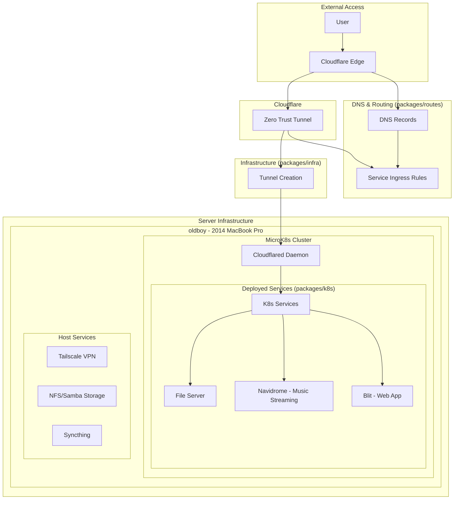

# JARITANET

[](https://github.com/radiosilence/jaritanet/actions/workflows/test.yml)
[](https://github.com/radiosilence/jaritanet/actions/workflows/cd.yml)
[](https://github.com/radiosilence/jaritanet/actions/workflows/email-tests.yml)

Infrastructure-as-code monorepo for securely exposing Kubernetes services through Cloudflare Tunnels.

## Architecture

Three Pulumi packages deploy in sequence to create a complete service exposure system:



## Package Structure

**packages/infra** - Pulumi TypeScript package for Cloudflare Zero Trust tunnels

- Establishes secure tunnel endpoints using Cloudflare API
- Configures Cloudflare access policies and authentication

**packages/k8s** - Pulumi TypeScript package for Kubernetes service deployment

- Connects to MicroK8s clusters via Tailscale VPN
- Deploys cloudflared daemon pods for tunnel connectivity
- Manages Kubernetes service deployments with Helm charts

**packages/routes** - Pulumi TypeScript package for DNS and tunnel routing

- Maps external domains to internal services via Cloudflare DNS
- Manages Bluesky protocol and Fastmail DNS records
- Creates Cloudflare tunnel ingress rules for service routing

## Deployment Flow

1. **Infrastructure** deploys Cloudflare tunnels
2. **Kubernetes** connects clusters and deploys services
3. **Routes** configures DNS and ingress routing

Traffic flows: `External Domain` → `Cloudflare` → `Tunnel` → `K8s Service`

## Server Management

Ansible playbooks provision and configure servers:

- MicroK8s cluster setup with storage and networking
- Tailscale VPN for secure cluster access
- File sharing via NFS and Samba
- Automated service account creation for CI/CD

## Development

```bash
bun typecheck:infra  # Type check infrastructure
bun typecheck:k8s    # Type check Kubernetes
bun typecheck:routes # Type check routes
./scripts/gen-schemas.ts  # Generate schemas
```
