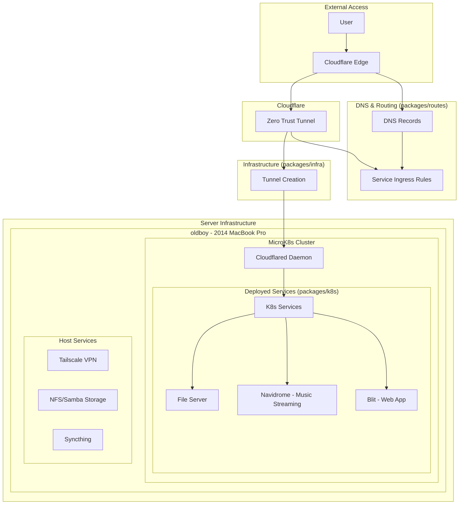

# JARITANET

[](https://github.com/radiosilence/jaritanet/actions/workflows/ci-cd.yml)

Infrastructure-as-code monorepo for securely exposing Kubernetes services through Cloudflare Tunnels.

## Architecture

Three Pulumi packages deploy in sequence to create a complete service exposure system:


```mermaid
graph TB
    subgraph "External Access"
        User[User] --> CF[Cloudflare Edge]
    end

    subgraph "Cloudflare"
        CF --> Tunnel[Zero Trust Tunnel]
    end

    subgraph "Infrastructure (packages/infra)"
        Tunnel --> TunnelConfig[Tunnel Creation]
    end

    subgraph "DNS & Routing (packages/routes)"
        CF --> DNS[DNS Records]
        Tunnel --> Ingress[Service Ingress Rules]
        DNS --> Ingress
    end

    subgraph "Server Infrastructure"
        subgraph "oldboy - 2014 MacBook Pro"
            TunnelConfig --> Cloudflared[Cloudflared Daemon]

            subgraph "MicroK8s Cluster"
                Cloudflared --> Services[K8s Services]

                subgraph "Deployed Services (packages/k8s)"
                    Services --> FileServer[File Server]
                    Services --> Navidrome[Navidrome - Music Streaming]
                    Services --> Blit[Blit - Web App]
                end
            end

            subgraph "Host Services"
                Tailscale[Tailscale VPN]
                Storage[NFS/Samba Storage]
                Sync[Syncthing]
            end
        end
    end
```

## Package Structure

**packages/infra** - Cloudflare Zero Trust tunnel infrastructure
- Creates and manages secure tunnel endpoints via Cloudflare API

**packages/k8s** - Kubernetes service deployments
- Deploys services to MicroK8s via Tailscale VPN
- Manages cloudflared daemon pods for tunnel connectivity

**packages/routes** - DNS and tunnel routing
- Maps external domains to internal services via Cloudflare DNS
- Manages Bluesky protocol and Fastmail DNS records
- Creates tunnel ingress rules for service routing

## Deployment Flow

1. **Infrastructure** deploys Cloudflare tunnels
2. **Kubernetes** connects clusters and deploys services
3. **Routes** configures DNS and ingress routing

Traffic flows: `External Domain` -> `Cloudflare` -> `Tunnel` -> `K8s Service`

## Server Management

Ansible playbooks provision and configure the homeserver:
- MicroK8s cluster with storage and networking addons
- Tailscale VPN for secure cluster access
- NFS and Samba file sharing
- Syncthing for P2P file sync
- SSH hardening and user management
- CI/CD service account generation

## Development

```bash
bun install              # Install dependencies
bun typecheck:infra      # Type check infrastructure
bun typecheck:k8s        # Type check Kubernetes
bun typecheck:routes     # Type check routes
bun test                 # Run tests
./scripts/gen-schemas.ts # Generate JSON schemas from Zod definitions
```

Pre-commit hooks (via Lefthook) run Biome formatting/linting and type checking on all packages.
