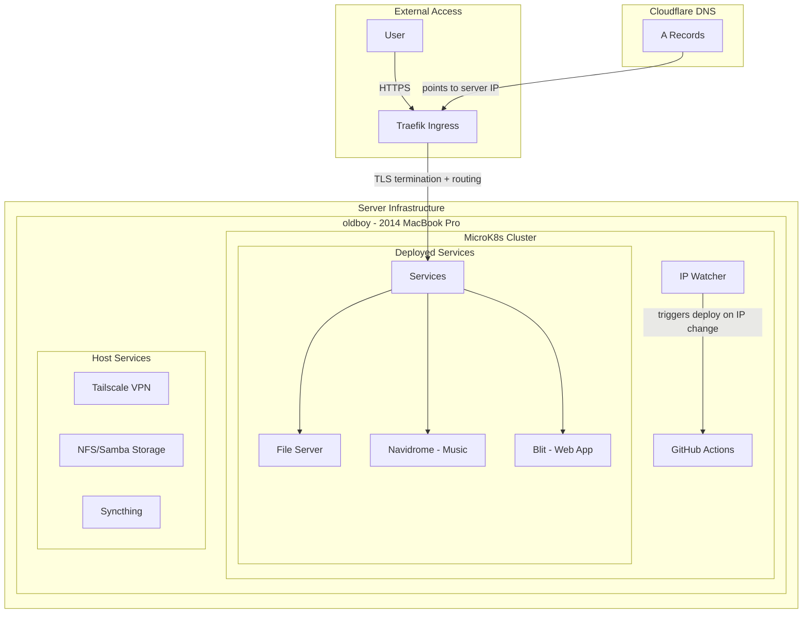

# JARITANET

[](https://github.com/radiosilence/jaritanet/actions/workflows/ci-cd.yml)

Infrastructure-as-code monorepo for exposing Kubernetes services via Traefik with automatic TLS. Optionally fronted by a Hetzner VPS gateway with Rathole tunnelling.

## Architecture

A single Pulumi stack deploys everything: Traefik handles TLS termination (Let's Encrypt via DNS-01) and hostname routing inside the K8s cluster. An optional IP-watcher pod tracks the server's external IP and dispatches a deploy to refresh Cloudflare A records when it changes.

The gateway also doubles as a censorship-resistant VPN (Hysteria2 + VLESS-REALITY), sharing `:443` with rathole — which relays any non-VPN traffic on to the in-cluster Traefik. See [`docs/architecture.md`](docs/architecture.md) for the full topology, transport choices, and the port-multiplexing trick.


```mermaid
graph TB
    subgraph "External Access"
        User[User] -->|HTTPS| Traefik
    end

    subgraph "Server Infrastructure"
        subgraph "oldboy - 2014 MacBook Pro"
            subgraph "MicroK8s Cluster"
                Traefik[Traefik Ingress] -->|TLS termination + routing| Services
                IPWatcher[IP Watcher] -->|triggers deploy on IP change| GHA[GitHub Actions]

                subgraph "Deployed Services"
                    Services --> FileServer[File Server]
                    Services --> Navidrome[Navidrome - Music]
                    Services --> Blit[Blit - Web App]
                end
            end

            subgraph "Host Services"
                Tailscale[Tailscale VPN]
                Storage[NFS/Samba Storage]
                Sync[Syncthing]
            end
        end
    end

    subgraph "Cloudflare DNS"
        DNS[A Records] -->|points to server IP| Traefik
    end
```

### Optional: VPS Gateway

When gateway credentials are configured, a VPS running Rathole acts as a stateless TCP relay. Your home IP disappears from DNS and all traffic routes through the VPS. Traefik keeps hostPort 443 as a fallback regardless — if the relay dies, port-forwarding still works.

Set `HCLOUD_TOKEN` and the deploy provisions a Hetzner VPS gateway; leave it
unset for direct mode (DNS points at the home IP, Traefik serves on hostPort
443). The gateway also doubles as the VPN entry hub — see
[`docs/architecture.md`](docs/architecture.md).

| Mode | Trigger | Cost |
|---|---|---|
| Hetzner gateway | `HCLOUD_TOKEN` set | ~EUR3.85/mo (CX23) |
| Direct | unset | free (home IP) |

```
User -> VPS:443 -> Rathole tunnel -> Traefik -> Service
```

## How It Works

1. **Traefik** terminates TLS using Let's Encrypt certs (DNS-01 via Cloudflare API) and routes by hostname.
2. **Cloudflare DNS** A records point service hostnames at the server's external IP.
3. **IP watcher** — an optional pod (enabled by `DEPLOY_TOKEN`) checks the external IP every 60s via Cloudflare's `1.1.1.1/cdn-cgi/trace` and, on change, dispatches a deploy to refresh the A records. Most useful in direct mode; with a gateway, DNS points at the VPS's static IP so it's a dormant fallback.
4. **Deploys** trigger on push to `main` (package changes) or manual `workflow_dispatch` — there is no scheduled/cron reconcile.

## Topology configuration

The VPN topology is three config lists in `packages/infra/Pulumi.main.yaml`.

**`gateway`** — the single entry hub (a Hetzner VPS). Runs Xray (VLESS-REALITY,
`:443/tcp`), Hysteria2 (`:443/udp`), rathole, and the tailnet relay. This is
what clients connect *through*; `entry-select` picks the protocol.

**`exits`** — where the gateway *egresses* your traffic (`exit-select`). An exit
is just `ss-rust + rathole`, reached over the gateway's rathole tunnel.

```yaml
jaritanet:exits:
  - name: oldboy      # picker tag `exit-oldboy`; the name is just a label
```

- **`name`** is cosmetic — the picker tag (`exit-<name>`) and resource names.
- **`substrate`** decides *where it runs* (and thus which IP it egresses),
  **not** the name:
  - `k8s` (default) → the home MicroK8s cluster (the only one) → home IP.
  - `vps` → provisions a dedicated box in `location` → that box's IP. *(Not
    implemented yet — k8s only for now.)*
- **`port`** (the gateway loopback port) is auto-derived from the name; only set
  it to resolve a rare name-hash collision.

**`edges`** — optional *additional* entry gateways (hy2 + REALITY), appearing in
`entry-select`. Not needed with a single gateway; see
[`docs/architecture.md`](docs/architecture.md).

## Package Structure

Everything lives in a single Pulumi package at `packages/infra/`:

- **`src/modules/gateway.ts`** — Hetzner VPS gateway: Xray/Hysteria2 entry + rathole + tailnet relay (optional)
- **`src/modules/edge.ts`** — standalone VPN edge boxes in other locations (hy2 + REALITY + tailnet relay); add via `edges` in config. See [`docs/architecture.md`](docs/architecture.md#edge-nodes-multi-location)
- **`src/modules/ingress.ts`** — Traefik Helm chart, Rathole client, IngressRoutes, IP watcher
- **`src/modules/dns.ts`** — Cloudflare A records, Fastmail MX/DKIM, Bluesky ATProto
- **`src/modules/singbox.ts`** — builds the sing-box client profile from the nodes and delivers it to the file server over SSH (change-detected, Telegram notify)
- **`src/modules/exit.ts`** — selectable egress exit node (ss-rust in-cluster), reached via the rathole tunnel, egressing its own IP. Add via `exits` in config
- **`src/templates/service.ts`** — K8s Deployment/Service/PV/PVC templates

## Secrets

### GitHub Actions Secrets

**Deploy (`ci-cd.yml`) — Pulumi core**

| Secret | Required | Purpose |
|---|---|---|
| `PULUMI_ACCESS_TOKEN` | Yes | Pulumi Cloud state |
| `CLOUDFLARE_API_TOKEN` | Yes | DNS + Traefik ACME DNS-01 (DNS:Edit, Zone:Read) |
| `CLOUDFLARE_ACCOUNT_ID` | Yes | Cloudflare account id |
| `ACME_EMAIL` | Yes | Let's Encrypt account email (Traefik) |
| `KUBE_HOST` / `KUBE_API_PORT` / `KUBE_TOKEN` | Yes | K8s API access (host = tailnet IP, token base64) |
| `NAVIDROME_HOSTNAME` / `FILES_HOSTNAME` / `BLIT_HOSTNAME` | Yes | Service hostnames (`BLIT_HOSTNAME` is also injected as the REALITY `serverName`) |

**Tailscale**

| Secret | Required | Purpose |
|---|---|---|
| `TS_OAUTH_CLIENT_ID` / `TS_OAUTH_SECRET` | Yes | OAuth for CI to reach the K8s API over the tailnet (`tag:ci`) |
| `TS_AUTHKEY` | No | OAuth client secret (`tskey-client-…`, `tag:server`) that joins the gateway/edges to the tailnet — enables the relay |

**Gateway (optional — absent = direct mode)**

| Secret | Required | Purpose |
|---|---|---|
| `HCLOUD_TOKEN` | No | Hetzner API token — provisions the VPS gateway |

**sing-box profile delivery (optional)**

| Secret | Required | Purpose |
|---|---|---|
| `SINGBOX_SLUG` | No | Unguessable path for the hosted client profile |
| `TAILNET_MAGICDNS_SUFFIX` | No | Tailnet MagicDNS suffix baked into the profile |
| `TELEGRAM_BOT_TOKEN` / `TELEGRAM_CHAT_ID` | No | Telegram bot + chat for the profile URL/QR notify |

**Ansible / server provisioning (`run-playbook.yml`)**

| Secret | Required | Purpose |
|---|---|---|
| `SSH_PRIVATE_KEY` | Yes | SSH key to oldboy (ansible + Pulumi's profile delivery) |
| `OLDBOY_HOST` / `OLDBOY_USER` / `OLDBOY_PASSWORD` | Yes | oldboy tailnet host, SSH user, sudo password |
| `SAMBA_PASSWORD` | Yes | Samba share password |
| `GIT_SSH_KEY` | Yes | SSH key for git access during playbook runs |

**Automation**

| Secret | Required | Purpose |
|---|---|---|
| `SECRETS_PAT` | Yes | PAT for `update-secrets` (pushes generated kube secrets) |
| `APP_PRIVATE_KEY` | Yes | GitHub App private key for `update-apps` (pairs with the `APP_ID` repo variable) |
| `DEPLOY_TOKEN` | No | GitHub PAT (Actions:write) — enables the direct-mode IP-watcher pod |

### Enabling the gateway

```bash
# console.hetzner.cloud > Project > Security > API Tokens
gh secret set HCLOUD_TOKEN
```

Next deploy provisions the VPS, deploys rathole, and flips DNS to the VPS IP. Remove the secret to fall back to direct mode.

## Development

```bash
aube install              # Install dependencies
aube run lint             # Lint with oxlint
aube run lint:fix         # Lint and auto-fix
aube run fmt              # Format with oxfmt
aube run fmt:check        # Check formatting
aube run typecheck:infra  # Type check
aube run test             # Run tests
./scripts/gen-schemas.ts  # Generate JSON schemas
```

Pre-commit hooks (via Lefthook) run oxlint, oxfmt, and type checking.

## Automated Updates

The `update-apps.yml` workflow runs daily and checks for new versions of:

- **Navidrome** — Docker image tag from GitHub releases
- **Traefik** — Helm chart version from GitHub releases

Updates are auto-committed and trigger a deploy.

## Server Management

Ansible playbooks provision and configure the homeserver (MicroK8s, Tailscale, NFS/Samba, Syncthing, SSH hardening). See `ansible/` directory.
