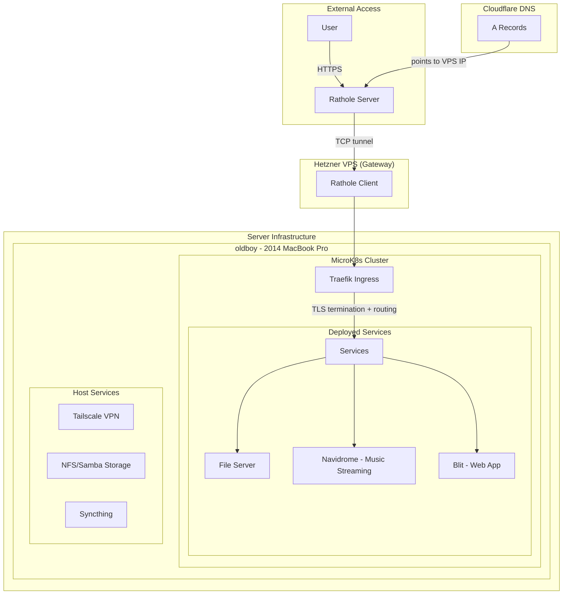

# JARITANET

[](https://github.com/radiosilence/jaritanet/actions/workflows/ci-cd.yml)

Infrastructure-as-code monorepo for exposing Kubernetes services via a Hetzner VPS gateway with Rathole tunnelling and Traefik TLS termination.

## Architecture

A single Pulumi stack deploys everything: a Hetzner VPS running Rathole as a dumb TCP relay, Traefik inside the K8s cluster handling TLS termination and routing, and Cloudflare DNS pointing at the VPS.


```mermaid
graph TB
    subgraph "External Access"
        User[User] -->|HTTPS| VPS
    end

    subgraph "Hetzner VPS (Gateway)"
        VPS[Rathole Server] -->|TCP tunnel| RatholeClient
    end

    subgraph "Server Infrastructure"
        subgraph "oldboy - 2014 MacBook Pro"
            subgraph "MicroK8s Cluster"
                RatholeClient[Rathole Client] --> Traefik[Traefik Ingress]
                Traefik -->|TLS termination + routing| Services

                subgraph "Deployed Services"
                    Services --> FileServer[File Server]
                    Services --> Navidrome[Navidrome - Music Streaming]
                    Services --> Blit[Blit - Web App]
                end
            end

            subgraph "Host Services"
                Tailscale[Tailscale VPN]
                Storage[NFS/Samba Storage]
                Sync[Syncthing]
            end
        end
    end

    subgraph "Cloudflare DNS"
        DNS[A Records] -->|points to VPS IP| VPS
    end
```

## How It Works

1. **Hetzner VPS** runs Rathole server — a stateless TCP relay. No certs, no routing logic, just pipes ports 80/443 to the cluster.
2. **Rathole client** in K8s connects outbound to the VPS (no inbound ports on home network).
3. **Traefik** terminates TLS using Let's Encrypt certs (DNS-01 challenge via Cloudflare API) and routes by hostname to services.
4. **Cloudflare DNS** A records point service hostnames at the VPS IP.

Traffic flow: `User -> Hetzner VPS:443 -> Rathole tunnel -> Traefik (TLS + routing) -> K8s Service`

## Package Structure

Everything lives in a single Pulumi package at `packages/infra/`:

- **`src/modules/gateway.ts`** — Hetzner VPS, firewall, Rathole server provisioning
- **`src/modules/ingress.ts`** — Traefik Helm chart, Rathole client, IngressRoutes
- **`src/modules/dns.ts`** — Cloudflare A records, Fastmail MX/DKIM, Bluesky ATProto
- **`src/templates/service.ts`** — K8s Deployment/Service/PV/PVC templates

## Secrets

### GitHub Actions Secrets (required for CI/CD)

| Secret | Purpose | How to get |
|---|---|---|
| `PULUMI_ACCESS_TOKEN` | Pulumi Cloud state management | [app.pulumi.com](https://app.pulumi.com) > Settings > Access Tokens |
| `CLOUDFLARE_API_TOKEN` | DNS management + Traefik ACME DNS-01 | Cloudflare dashboard > API Tokens > Create Token (needs DNS:Edit, Zone:Read) |
| `CLOUDFLARE_ACCOUNT_ID` | Cloudflare account identifier | Cloudflare dashboard > any zone > Overview sidebar |
| `HCLOUD_TOKEN` | Hetzner Cloud VPS provisioning | [console.hetzner.cloud](https://console.hetzner.cloud) > Project > Security > API Tokens |
| `TS_OAUTH_CLIENT_ID` | Tailscale VPN access to K8s cluster | [login.tailscale.com](https://login.tailscale.com/admin/settings/oauth) > OAuth clients |
| `TS_OAUTH_SECRET` | Tailscale OAuth secret | Same as above |
| `KUBE_HOST` | K8s API server hostname (Tailscale IP) | `tailscale status` on the server |
| `KUBE_API_PORT` | K8s API server port | Default: `16443` for MicroK8s |
| `KUBE_TOKEN` | K8s service account token (base64) | Generated by Ansible microk8s role |
| `NAVIDROME_HOSTNAME` | Public hostname for Navidrome | e.g. `navidrome.blit.cc` |
| `FILES_HOSTNAME` | Public hostname for file server | e.g. `files.blit.cc` |
| `BLIT_HOSTNAME` | Public hostname for Blit | e.g. `blit.cc` |

### Pulumi Encrypted Secrets (in `Pulumi.main.yaml`)

These are encrypted by Pulumi and checked into the repo:

| Config key | Purpose |
|---|---|
| `cloudflare:apiToken` | Cloudflare provider authentication |
| `hcloud:token` | Hetzner provider authentication |

Set these locally with:

```bash
cd packages/infra
pulumi config set --secret cloudflare:apiToken <token>
pulumi config set --secret hcloud:token <token>
```

## Development

```bash
bun install              # Install dependencies
bun run lint             # Lint with oxlint
bun run lint:fix         # Lint and auto-fix
bun run fmt              # Format with oxfmt
bun run fmt:check        # Check formatting
bun run typecheck:infra  # Type check
bun run test             # Run tests
./scripts/gen-schemas.ts # Generate JSON schemas from Zod definitions
```

Pre-commit hooks (via Lefthook) run oxlint, oxfmt, and type checking.

## Server Management

Ansible playbooks provision and configure the homeserver:

- MicroK8s cluster with storage and networking addons
- Tailscale VPN for secure cluster access
- NFS and Samba file sharing
- Syncthing for P2P file sync
- SSH hardening and user management
- CI/CD service account generation

## Migration from Cloudflare Tunnels

This setup replaces the previous three-package architecture (infra/k8s/routes) that used Cloudflare Zero Trust Tunnels. The old stacks (`radiosilence/jaritanet/main`, `radiosilence/jaritanet-k8s/main`, `radiosilence/jaritanet-routes/main`) should be destroyed after the new stack is operational.

Migration steps:

1. Set up the new secrets (`HCLOUD_TOKEN` in GitHub, `hcloud:token` in Pulumi config)
2. Run `pulumi up` — provisions VPS, deploys Traefik + Rathole, creates DNS records
3. Wait for DNS propagation and cert issuance
4. Verify services are accessible
5. Destroy old Pulumi stacks
6. Remove cloudflared from cluster (handled automatically — it's no longer deployed)
