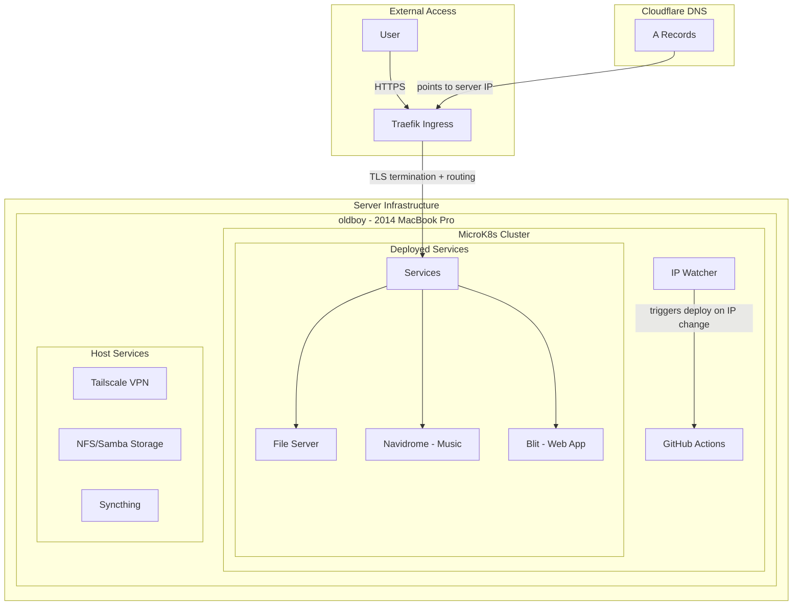

# JARITANET

[](https://github.com/radiosilence/jaritanet/actions/workflows/ci-cd.yml)

Infrastructure-as-code monorepo for exposing Kubernetes services via Traefik with automatic TLS. Optionally fronted by a Hetzner VPS gateway with Rathole tunnelling.

## Architecture

A single Pulumi stack deploys everything: Traefik handles TLS termination (Let's Encrypt via DNS-01) and hostname routing inside the K8s cluster. An IP watcher pod monitors the server's external IP and triggers DNS updates when it changes — DIY dynamic DNS powered by Cloudflare.

The gateway also doubles as a censorship-resistant VPN (Hysteria2 + VLESS-REALITY, sharing :443 with the reverse proxy). See [`docs/architecture.md`](docs/architecture.md) for the full topology, transport choices, and the port-multiplexing trick.


```mermaid
graph TB
    subgraph "External Access"
        User[User] -->|HTTPS| Traefik
    end

    subgraph "Server Infrastructure"
        subgraph "oldboy - 2014 MacBook Pro"
            subgraph "MicroK8s Cluster"
                Traefik[Traefik Ingress] -->|TLS termination + routing| Services
                IPWatcher[IP Watcher] -->|triggers deploy on IP change| GHA[GitHub Actions]

                subgraph "Deployed Services"
                    Services --> FileServer[File Server]
                    Services --> Navidrome[Navidrome - Music]
                    Services --> Blit[Blit - Web App]
                end
            end

            subgraph "Host Services"
                Tailscale[Tailscale VPN]
                Storage[NFS/Samba Storage]
                Sync[Syncthing]
            end
        end
    end

    subgraph "Cloudflare DNS"
        DNS[A Records] -->|points to server IP| Traefik
    end
```

### Optional: VPS Gateway

When gateway credentials are configured, a VPS running Rathole acts as a stateless TCP relay. Your home IP disappears from DNS and all traffic routes through the VPS. Traefik keeps hostPort 443 as a fallback regardless — if the relay dies, port-forwarding still works.

The gateway provider is auto-detected from available credentials:

| Priority | Provider | Trigger | Cost |
|---|---|---|---|
| 1 | Hetzner | `HCLOUD_TOKEN` set | ~EUR3.85/mo (CX22) |
| 2 | Oracle Cloud | `OCI_TENANCY_OCID` set | Free forever (ARM A1.Flex) |
| 3 | Direct | Neither set | Free (uses detected external IP) |

```
User -> VPS:443 -> Rathole tunnel -> Traefik -> Service
```

## How It Works

1. **Traefik** terminates TLS using Let's Encrypt certs (DNS-01 via Cloudflare API) and routes by hostname.
2. **Cloudflare DNS** A records point service hostnames at the server's external IP.
3. **IP watcher** (direct mode only) — a pod checks the external IP every 60s via Cloudflare's `1.1.1.1/cdn-cgi/trace` and, on change, dispatches a deploy to refresh the A records. With a gateway, DNS points at the VPS's static IP, so the watcher is a dormant fallback (gated behind `DEPLOY_TOKEN`).
4. **Deploys** trigger on push to `main` (package changes) or manual `workflow_dispatch` — there is no scheduled/cron reconcile.

## Package Structure

Everything lives in a single Pulumi package at `packages/infra/`:

- **`src/modules/gateway.ts`** — Hetzner VPS gateway (optional)
- **`src/modules/gateway-oci.ts`** — Oracle Cloud ARM gateway (optional)
- **`src/modules/edge.ts`** — standalone VPN edge boxes in other locations (hy2 + REALITY + tailnet relay); add via `edges` in config. See [`docs/architecture.md`](docs/architecture.md#edge-nodes-multi-location)
- **`src/modules/ingress.ts`** — Traefik Helm chart, Rathole client, IngressRoutes, IP watcher
- **`src/modules/dns.ts`** — Cloudflare A records, Fastmail MX/DKIM, Bluesky ATProto
- **`src/modules/singbox.ts`** — builds the sing-box client profile from the nodes and delivers it to the file server over SSH (change-detected, Telegram notify)
- **`src/templates/service.ts`** — K8s Deployment/Service/PV/PVC templates

## Secrets

### GitHub Actions Secrets

| Secret | Required | Purpose |
|---|---|---|
| `PULUMI_ACCESS_TOKEN` | Yes | Pulumi Cloud state management |
| `CLOUDFLARE_API_TOKEN` | Yes | DNS management + Traefik ACME DNS-01 (needs DNS:Edit, Zone:Read) |
| `CLOUDFLARE_ACCOUNT_ID` | Yes | Cloudflare account identifier |
| `TS_OAUTH_CLIENT_ID` | Yes | Tailscale VPN access to K8s cluster |
| `TS_OAUTH_SECRET` | Yes | Tailscale OAuth secret |
| `KUBE_HOST` | Yes | K8s API server hostname (Tailscale IP) |
| `KUBE_API_PORT` | Yes | K8s API server port (default: 16443) |
| `KUBE_TOKEN` | Yes | K8s service account token (base64) |
| `NAVIDROME_HOSTNAME` | Yes | Public hostname for Navidrome |
| `FILES_HOSTNAME` | Yes | Public hostname for file server |
| `BLIT_HOSTNAME` | Yes | Public hostname for Blit |
| `DEPLOY_TOKEN` | No | GitHub PAT (Actions:write) — enables IP watcher pod |
| `HCLOUD_TOKEN` | No | Hetzner Cloud API token — enables Hetzner gateway |
| `OCI_TENANCY_OCID` | No | Oracle Cloud tenancy — enables OCI gateway |
| `OCI_USER_OCID` | No | Oracle Cloud user OCID |
| `OCI_FINGERPRINT` | No | Oracle Cloud API key fingerprint |
| `OCI_PRIVATE_KEY` | No | Oracle Cloud API key (PEM contents) |
| `OCI_REGION` | No | Oracle Cloud region (e.g. `eu-amsterdam-1`) |

### Enabling a Gateway

Set credentials for one provider — the deploy auto-detects which to use.

**Hetzner** (~EUR3.85/mo):
```bash
# console.hetzner.cloud > Project > Security > API Tokens
gh secret set HCLOUD_TOKEN
```

**Oracle Cloud** (free forever):
```bash
# cloud.oracle.com > Profile > My profile > API keys > Add API key
# The console shows tenancy/user OCIDs and generates the key+fingerprint
gh secret set OCI_TENANCY_OCID   # Profile > Tenancy: <ocid shown at top>
gh secret set OCI_USER_OCID      # Profile > My profile: <ocid under user info>
gh secret set OCI_FINGERPRINT    # Shown after adding the API key
gh secret set OCI_PRIVATE_KEY    # Paste the downloaded PEM private key
gh secret set OCI_REGION         # e.g. eu-amsterdam-1, uk-london-1
```

Next deploy provisions the VPS, deploys rathole, and flips DNS to the VPS IP. To switch back to direct mode, remove the secrets.

## Development

```bash
aube install              # Install dependencies
aube run lint             # Lint with oxlint
aube run lint:fix         # Lint and auto-fix
aube run fmt              # Format with oxfmt
aube run fmt:check        # Check formatting
aube run typecheck:infra  # Type check
aube run test             # Run tests
./scripts/gen-schemas.ts  # Generate JSON schemas
```

Pre-commit hooks (via Lefthook) run oxlint, oxfmt, and type checking.

## Automated Updates

The `update-apps.yml` workflow runs daily and checks for new versions of:

- **Navidrome** — Docker image tag from GitHub releases
- **Traefik** — Helm chart version from GitHub releases

Updates are auto-committed and trigger a deploy.

## Server Management

Ansible playbooks provision and configure the homeserver (MicroK8s, Tailscale, NFS/Samba, Syncthing, SSH hardening). See `ansible/` directory.
