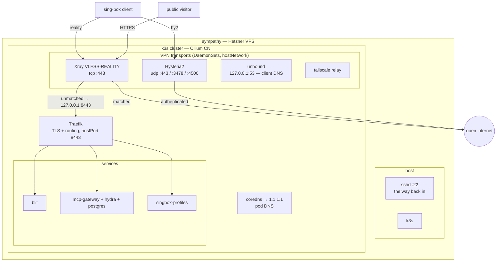

# JARITANET

[](https://github.com/radiosilence/jaritanet/actions/workflows/ci-cd.yml)

Infrastructure-as-code monorepo for a single Hetzner VPS that runs its own Kubernetes cluster: public services behind Traefik with automatic TLS, and a censorship-resistant VPN, both as workloads in that cluster.

## Architecture

One `pulumi up` creates the VPS, installs k3s on it, reads the kubeconfig back,
and deploys everything into the cluster it just built. There is no secret
round-trip and nothing for a human to rotate — the kubeconfig is an output of
the same program that consumes it.

The box runs **k3s and sshd, and nothing else**. Xray, Hysteria2, unbound and
tailscale are DaemonSets rather than systemd units; Traefik, the web services
and the MCP gateway are ordinary Deployments. `hostNetwork` is what lets the
VPN transports own the host's real ports while still being cluster workloads.


```mermaid
graph TB
    CLIENT["sing-box client"]
    VISITOR["public visitor"]

    subgraph vps["sympathy — Hetzner VPS"]
        subgraph host["host"]
            SSHD["sshd :22<br/>the way back in"]
            K3S["k3s"]
        end

        subgraph k8s["k3s cluster — Cilium CNI"]
            subgraph entry["VPN transports (DaemonSets, hostNetwork)"]
                XR["Xray VLESS-REALITY<br/>tcp :443"]
                HY["Hysteria2<br/>udp :443 / :3478 / :4500"]
                UB["unbound<br/>127.0.0.1:53 — client DNS"]
                TS["tailscale relay"]
            end

            TR["Traefik<br/>TLS + routing, hostPort 8443"]
            subgraph apps["services"]
                BL["blit"]
                MCP["mcp-gateway + hydra + postgres"]
                PROF["singbox-profiles"]
            end
            CD["coredns → 1.1.1.1<br/>pod DNS"]
        end
    end

    INET(("open internet"))

    CLIENT -->|reality| XR
    CLIENT -->|hy2| HY
    VISITOR -->|"HTTPS"| XR

    XR -->|"unmatched → 127.0.0.1:8443"| TR
    XR -->|"matched"| INET
    HY -->|"authenticated"| INET
    TR --> BL
    TR --> MCP
    TR --> PROF
```

Xray owns `:443` and decides per connection: a valid VPN client is proxied out;
anything else — a real visitor, or a censor's probe — is relayed to Traefik on
`127.0.0.1:8443`. So the cover traffic hiding the proxy is the genuine site.

**Two resolvers, deliberately.** unbound answers VPN clients, which reach it at
`127.0.0.1:53` *through* the tunnel, and forwards upstream over DoT — so no
lookup crosses a hostile network and none leaves the gateway in the clear.
coredns answers pods and forwards to 1.1.1.1. Merging them would route client
traffic into cluster service names.

See [`docs/architecture.md`](docs/architecture.md) for the topology, transport
choices and the `:443` multiplexing.

### The gateway is not optional any more

`HCLOUD_TOKEN` and `gateway.k3s` are both required: the cluster runs on the VPS
the token provisions, so there is no cluster without it.

| | |
|---|---|
| Host | Hetzner CX33, Nuremberg (~EUR13/mo) |
| Cluster | k3s, single node, Cilium CNI |
| Storage | k3s local-path for PVCs; static local PVs with node affinity for existing media |

A second node (`lady`, a Raspberry Pi) joins by dialling the VPS's public
`:6443` — no tunnel needed. Media stays on its disk, which is what the static
PV's `nodeAffinity` is for: it pins the pod to the box holding the files.

## How It Works

0. **k3s** is installed on the VPS by the same `pulumi up`, which reads its kubeconfig back as a command output and builds the Kubernetes provider from it. **Cilium** is the CNI — k3s runs with `--flannel-backend=none --disable-kube-proxy`, so until Cilium is installed the node is deliberately `NotReady`.
1. **Traefik** terminates TLS using Let's Encrypt certs (DNS-01 via Cloudflare API) and routes by hostname, on hostPort 8443 because Xray owns 443.
2. **Cloudflare DNS** A records point service hostnames at the server's external IP.
3. **IP watcher** — an optional pod (enabled by `DEPLOY_TOKEN`) checks the external IP every 60s and dispatches a deploy on change. Dormant here: the VPS address is static. It stays for a future node whose address moves.
4. **Deploys** trigger on push to `main` (package changes) or manual `workflow_dispatch` — there is no scheduled/cron reconcile.

## Topology configuration

The VPN topology is three config lists in `packages/infra/Pulumi.main.yaml`.

**`gateway`** — the single entry hub (a Hetzner VPS). Runs Xray (VLESS-REALITY,
`:443/tcp`), Hysteria2 (`:443/udp`), rathole, and the tailnet relay. This is
what clients connect *through*; `entry-select` picks the protocol.

**`exits`** — where the gateway *egresses* your traffic (`exit-select`). An exit
is `ss-rust + rathole`, reached over a rathole tunnel, and it exists to present
somebody else's IP — a residential one, typically.

```yaml
jaritanet:exits:
  - name: lady        # picker tag `exit-lady`; the name is just a label
```

- **`name`** is cosmetic — the picker tag (`exit-<name>`) and resource names.
- **`port`** (the gateway loopback port) is derived from the name; set it only
  to resolve a rare hash collision.

Currently empty. `lady` can take the role once it joins — an exit only needs to
be somewhere with an interesting address.

**`edges`** — optional *additional* entry gateways (hy2 + REALITY), appearing in
`entry-select`. Not needed with a single gateway; see
[`docs/architecture.md`](docs/architecture.md).

## Package Structure

One Pulumi program, assembled from packages that don't know it exists. A
component package describes a thing you could run anywhere; `packages/infra`
describes *this* deployment. Dependencies only ever point that way — nothing
imports `infra`, and the only sideways import is `@jaritanet/k8s`.

**`@jaritanet/hetzner`** — the machine

- **`k3s.ts`** — installs k3s over SSH and returns its kubeconfig as the same command's stdout, so config and cluster cannot drift apart
- **`cilium.ts`** — the CNI, with `kubeProxyReplacement` (which is what makes `hostPort` work at all)
- **`vps.ts`** — firewall rules and the sysctls the transports need (BBR, UDP buffers)

**`@jaritanet/vpn`** — the transports. DaemonSets on the entry-labelled node, `hostNetwork`

- **`xray.ts`** — VLESS-Vision-REALITY on tcp/443, relaying non-clients to Traefik
- **`hysteria.ts`** — Hysteria2 on udp/443 plus alt ports, one container each
- **`tailscale.ts`** — tailnet relay, node state in a Secret so identity survives the node
- **`unbound.ts`** — the client-facing resolver on `127.0.0.1:53`, DoT upstream
- **`exit.ts`** — selectable egress exit node, reached via a rathole tunnel
- **`singbox.ts`** / **`profiles.ts`** — builds each user's profile (`buildProfile`) and serves it from a Secret via `serve-from-env`; the routing table *is* the content, so a rotated slug stops existing rather than lingering as a stale file
- **`*-systemd.ts`** — the same transports installed over SSH, still used by edges, which have no cluster. They take an SSH connection and opaque `dependsOn` rather than a typed server, so nothing here depends on a cloud provider

**`@jaritanet/ingress`**, **`@jaritanet/dns`**, **`@jaritanet/mcp-gateway`**, **`@jaritanet/k8s`**

- **`ingress.ts`** — Traefik Helm chart, IngressRoutes, IP watcher, and a rathole client when the cluster is *not* co-located with the gateway
- **`dns.ts`** — Cloudflare A records, Fastmail MX/DKIM, Bluesky ATProto
- **`mcp-gateway.ts`** — OAuth-fronted gateway for self-hosted MCP servers (Hydra + Postgres)
- **`service.ts`** — K8s Deployment/Service/PV/PVC templates, plus the schemas and helpers the other packages share

**`packages/infra`** — this stack

- **`main.ts`** — orchestrates everything; **`gateway.ts`** / **`edge.ts`** compose a Hetzner box with transports on it
- **`conf.schemas.ts`** — the config surface, assembled from the component schemas
- **`env.ts`** — the only place `process.env` is read

Packages are imported as TypeScript source: Node resolves a workspace symlink to
its real path, which is outside `node_modules`, so type stripping applies and the
deploy needs no build step. They are `private` for now — publishing needs a `tsc`
emit and `@pulumi/pulumi` moved to a peer dependency.

## Secrets

### GitHub Actions Secrets

**Deploy (`ci-cd.yml`) — Pulumi core**

| Secret | Required | Purpose |
|---|---|---|
| `PULUMI_ACCESS_TOKEN` | Yes | Pulumi Cloud state |
| `CLOUDFLARE_API_TOKEN` | Yes | DNS + Traefik ACME DNS-01 (DNS:Edit, Zone:Read) |
| `CLOUDFLARE_ACCOUNT_ID` | Yes | Cloudflare account id |
| `ACME_EMAIL` | Yes | Let's Encrypt account email (Traefik) |
| `BLIT_HOSTNAME` / `MCP_HOSTNAME` / `MCP_AUTH_HOSTNAME` | Yes | Service hostnames |
| `HCLOUD_TOKEN` | Yes | Hetzner API token. The cluster runs on the VPS it provisions, so this is not optional |
| `SSH_PUBLIC_KEY` | No | Break-glass admin key, installed on the gateway and every edge (see below). Unset = nobody but Pulumi can SSH to them |
| `UBUNTU_PRO_TOKEN` | No | Ubuntu Pro, for kernel livepatch on the gateway and every edge. Free for personal use on up to five machines. Unset = the reboot window is still set and only livepatch is skipped |
| `TS_OAUTH_CLIENT_ID` / `TS_OAUTH_CLIENT_SECRET` / `TS_TAILNET` | No | Manage the tailnet policy file as code (see below). Unset = policy stays hand-managed |

**Tailscale**

| Secret | Required | Purpose |
|---|---|---|
| `TS_AUTHKEY` | No | OAuth client secret (`tskey-client-…`, `tag:server`) that joins the gateway/edges to the tailnet — enables the relay |

CI no longer joins the tailnet. It reaches the API server on the VPS's public
`:6443`, so a tailnet outage cannot fail a deploy — which it repeatedly did.

**sing-box profiles (optional)**

| Secret | Required | Purpose |
|---|---|---|
| `SINGBOX_SLUG` | No | Base secret for per-user profile paths (each user's slug is derived from it, so URLs are stable but unguessable) |
| `TAILNET_MAGICDNS_SUFFIX` | No | Tailnet MagicDNS suffix baked into the profile |
| `TELEGRAM_BOT_TOKEN` / `TELEGRAM_CHAT_ID` | No | Telegram bot + chat for the per-user profile URL notify |
| `VPN_ENTRY_LABEL` | Yes | Node label key marking a machine as a VPN entry, e.g. `jaritanet.radiosilence.dev/vpn-entry`. Read once and passed to both the command that labels the node and every transport's `nodeSelector`, so they cannot disagree — a selector matching no node schedules nothing while the cluster looks healthy. Required for that reason: a red deploy beats a silently dark VPN |
| `VPN_USERS` | No | Per-user VPN roster (RBAC). Comma-separated; trailing `+` = admin. E.g. `jc+,guest1`. Unset → single implicit owner-admin. Admin = hy2 + reality, all exits, tailnet; guest = reality-only, direct egress, no tailnet |

**Automation**

| Secret | Required | Purpose |
|---|---|---|
| `SECRETS_PAT` | Yes | PAT for `update-secrets` (pushes generated kube secrets) |
| `APP_PRIVATE_KEY` | Yes | GitHub App private key for `update-apps` (pairs with the `APP_ID` repo variable) |
| `DEPLOY_TOKEN` | No | GitHub PAT (Actions:write) — enables the direct-mode IP-watcher pod |

### Enabling the gateway

```bash
# console.hetzner.cloud > Project > Security > API Tokens
gh secret set HCLOUD_TOKEN
```

Next deploy provisions the VPS, installs k3s on it and deploys everything into
it. Removing the secret does not fall back to anything: there is no cluster
without the box.

### Break-glass SSH

```bash
gh secret set SSH_PUBLIC_KEY < ~/.ssh/id_ed25519.pub
```

Installs that key on the gateway and every edge, so `ssh root@<ip>` works. Only
worth having for one case: k3s failing to come up. Everything else — host files,
host networking, `systemctl` — is already reachable through a privileged pod
with `hostPID` and `nsenter`, and none of that exists without an API server. The
mechanism for adding a key is the broken thing at that moment, so the key has to
be there beforehand.

It arrives over SSH rather than through the server's `sshKeys` or `userData`,
both of which Hetzner applies only at creation: setting either would replace the
box, and with it the IP and the REALITY keypair every client profile carries.
Rotating the key is therefore a normal deploy. Unsetting the secret removes it.

The key lands in `/etc/ssh/admin_authorized_keys`, selected by an
`sshd_config.d` drop-in, never in the `authorized_keys` Pulumi authenticates
with — a mistake in that file locks the deploy out of the box it is deploying to.
Replacing a box reinstalls it: the resource is triggered by the server's id as
well as the key, so a rebuild cannot leave the new box without a way in.


### Automatic patching

Cloud images install security updates on their own and then leave them there:
`Automatic-Reboot` ships false, so a new kernel is downloaded and never booted.
Every box gets a 04:00 reboot window so the patches it installs take effect.

```bash
gh secret set UBUNTU_PRO_TOKEN   # from https://ubuntu.com/pro/dashboard
```

Adds livepatch on top, which applies high and critical kernel CVE fixes to the
*running* kernel — closing the interval between a fix landing and the next
window, which is where local privilege escalation lives. The two are not
substitutes: livepatch covers neither userspace nor fixes that restructure
kernel data, and stops supporting a kernel that drifts too far behind, so the
window is what keeps livepatch working. Free for personal use on five machines.

Rotating the token is not enough on its own — an attached box is never offered a
new one. Run `pro detach --assume-yes` on it first.

## Development

```bash
aube install              # Install dependencies
aube run lint             # Lint with oxlint
aube run lint:fix         # Lint and auto-fix
aube run fmt              # Format with oxfmt
aube run fmt:check        # Check formatting
aube run typecheck        # Type check every package
aube run test             # Run tests
./scripts/gen-schemas.ts  # Generate JSON schemas
```

Pre-commit hooks (via Lefthook) run oxlint, oxfmt, and type checking.

## Automated Updates

The `update-apps.yml` workflow runs daily against `.github/tracked-versions.yml`
— currently Navidrome, the Traefik chart, and the four MCP servers. A release
tag is never trusted alone: the registry is asked whether the image actually
published, including for entries already current, so a pin that stopped
resolving is reported rather than discovered at the next pod restart.

The containers built from this repo (`serve-from-env`, `files`) are **not**
tracked — they publish sha tags and cut no releases, so their pins move by hand.
See #197.

## Tailnet policy as code

The tailnet policy is the last line of defence for anything that reaches the
gateway. The gateway is a tailnet member so it can relay `100.x` over the
tunnel, so whatever it may reach, a bug in Xray or Hysteria may also reach —
grants contain that class of bug regardless of which layer above them is wrong.

Managing it here is opt-in and cannot clobber an existing policy: the provider
refuses to modify a policy file it has not imported. Bringing it under Pulumi:

1. **Create the OAuth client.** Admin console → *Settings* → *OAuth clients* →
   *Generate OAuth client*. Tick **`policy_file`** with **write** access (read
   alone lets Pulumi import but not apply). Nothing else is needed. The secret
   is shown once — copy it there and then. Free on the Personal plan.
2. **Set the secrets.** `gh secret set TS_OAUTH_CLIENT_ID`,
   `gh secret set TS_OAUTH_CLIENT_SECRET`, and `gh secret set TS_TAILNET` —
   the tailnet name is the one in the admin console's top-left switcher
   (e.g. `example.com` or `tail1234.ts.net`), not the org display name.
3. Copy the tailnet's **current** policy into
   `packages/infra/tailnet-policy.hujson`, replacing the placeholder. Bring what
   exists under version control before changing anything.
4. Import it so Pulumi adopts the existing policy rather than replacing it:
   `pulumi import tailscale:index/acl:Acl tailnet-policy acl`
5. Only now start tightening. This is where the value is, and it has its own
   order — the gateway currently joins as `tag:server`, shared with every other
   server, so no grant can single it out:

   1. Uncomment `tag:gateway` in `tagOwners` and deploy. **A node cannot
      advertise a tag the policy does not define**, so this must land first or
      the gateway drops off the tailnet on its next `tailscale up`.
   2. Mint a new auth key that is authorised for `tag:gateway` (admin console →
      *Keys* → *Generate auth key* → set the tag) and replace `TS_AUTHKEY`. The
      existing key can only assign the tags it was created with, so reusing it
      cannot work.
   3. Set `gateway.tailnet.tag` to `tag:gateway` and deploy. The node
      re-registers with the new tag.
   4. Write grants naming what the tunnel is actually used to reach.

Step 5.4 is the trap: the gateway is a *relay*, so whatever it cannot reach,
**you** cannot reach over the VPN either. The question is not how locked down it
can be, but what you actually use the tailnet for. Getting it wrong locks you out of your own mesh, and a bad policy is
recoverable only from the admin console, which is no fun from a train.
