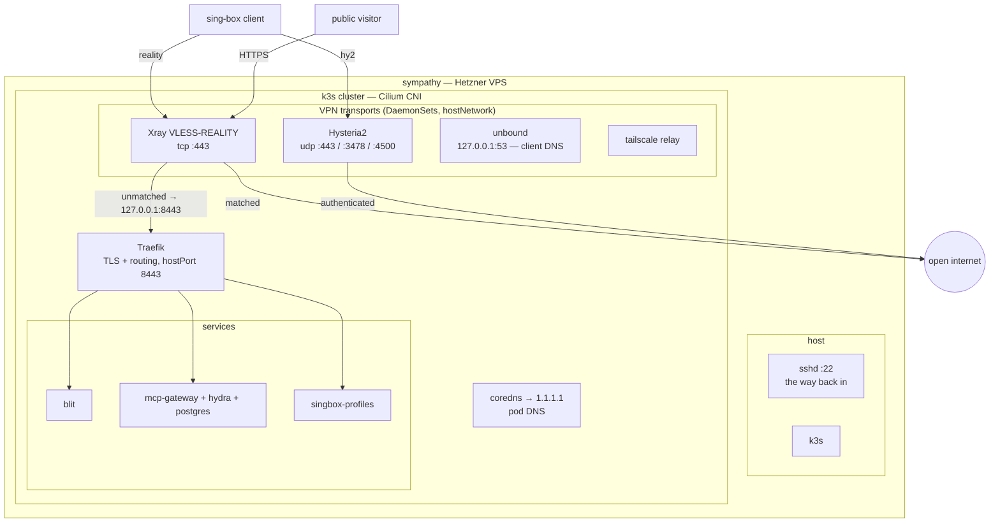

# JARITANET

[](https://github.com/radiosilence/jaritanet/actions/workflows/ci-cd.yml)

Infrastructure-as-code monorepo for a single Hetzner VPS that runs its own Kubernetes cluster: public services behind Traefik with automatic TLS, and a censorship-resistant VPN, both as workloads in that cluster.

## Architecture

One `pulumi up` creates the VPS, installs k3s on it, reads the kubeconfig back,
and deploys everything into the cluster it just built. There is no secret
round-trip and nothing for a human to rotate — the kubeconfig is an output of
the same program that consumes it.

The box runs **k3s and sshd, and nothing else**. Xray, Hysteria2, unbound and
tailscale are DaemonSets rather than systemd units; Traefik, the web services
and the MCP gateway are ordinary Deployments. `hostNetwork` is what lets the
VPN transports own the host's real ports while still being cluster workloads.


```mermaid
graph TB
    CLIENT["sing-box client"]
    VISITOR["public visitor"]

    subgraph vps["sympathy — Hetzner VPS"]
        subgraph host["host"]
            SSHD["sshd :22<br/>the way back in"]
            K3S["k3s"]
        end

        subgraph k8s["k3s cluster — Cilium CNI"]
            subgraph entry["VPN transports (DaemonSets, hostNetwork)"]
                XR["Xray VLESS-REALITY<br/>tcp :443"]
                HY["Hysteria2<br/>udp :443 / :3478 / :4500"]
                UB["unbound<br/>127.0.0.1:53 — client DNS"]
                TS["tailscale relay"]
            end

            TR["Traefik<br/>TLS + routing, hostPort 8443"]
            subgraph apps["services"]
                BL["blit"]
                MCP["mcp-gateway + hydra + postgres"]
                PROF["singbox-profiles"]
            end
            CD["coredns → 1.1.1.1<br/>pod DNS"]
        end
    end

    INET(("open internet"))

    CLIENT -->|reality| XR
    CLIENT -->|hy2| HY
    VISITOR -->|"HTTPS"| XR

    XR -->|"unmatched → 127.0.0.1:8443"| TR
    XR -->|"matched"| INET
    HY -->|"authenticated"| INET
    TR --> BL
    TR --> MCP
    TR --> PROF
```

Xray owns `:443` and decides per connection: a valid VPN client is proxied out;
anything else — a real visitor, or a censor's probe — is relayed to Traefik on
`127.0.0.1:8443`. So the cover traffic hiding the proxy is the genuine site.

**Two resolvers, deliberately.** unbound answers VPN clients, which reach it at
`127.0.0.1:53` *through* the tunnel, and forwards upstream over DoT — so no
lookup crosses a hostile network and none leaves the gateway in the clear.
coredns answers pods and forwards to 1.1.1.1. Merging them would route client
traffic into cluster service names.

See [`docs/architecture.md`](docs/architecture.md) for the topology, transport
choices and the `:443` multiplexing.

### The gateway is not optional any more

`gateway.hcloudToken` and `gateway.k3s` are both required: the cluster runs on the VPS
the token provisions, so there is no cluster without it.

| | |
|---|---|
| Host | Hetzner CX33, Nuremberg (~EUR13/mo) |
| Cluster | k3s, single node, Cilium CNI |
| Storage | k3s local-path for PVCs; static local PVs with node affinity for existing media |

A second node (`lady`, a Raspberry Pi) joins by dialling the VPS's public
`:6443` — no tunnel needed. Media stays on its disk, which is what the static
PV's `nodeAffinity` is for: it pins the pod to the box holding the files.

## How It Works

0. **k3s** is installed on the VPS by the same `pulumi up`, which reads its kubeconfig back as a command output and builds the Kubernetes provider from it. **Cilium** is the CNI — k3s runs with `--flannel-backend=none --disable-kube-proxy`, so until Cilium is installed the node is deliberately `NotReady`.
1. **Traefik** terminates TLS using Let's Encrypt certs (DNS-01 via Cloudflare API) and routes by hostname, on hostPort 8443 because Xray owns 443.
2. **Cloudflare DNS** A records point service hostnames at the server's external IP.
3. **Deploys** trigger on push to `main` (package changes) or manual `workflow_dispatch` — there is no scheduled/cron reconcile.

## Topology configuration

The VPN topology is three config lists in `packages/infra/Pulumi.main.yaml`.

**`gateway`** — the single entry hub (a Hetzner VPS). Runs Xray (VLESS-REALITY,
`:443/tcp`), Hysteria2 (`:443/udp`), and the tailnet relay. This is
what clients connect *through*; `entry-select` picks the protocol.

**`exits`** — where your traffic *egresses* (`exit-select`). An exit is an
ss-rust server on the machine whose IP it presents — a residential one,
typically. Entries reach it over the tailnet, so it works on a box behind NAT
with nothing forwarded.

```yaml
jaritanet:exits:
  - name: lady
    nodeLabel: jaritanet.radiosilence.dev/vpn-exit
    server: 100.74.66.121
```

- **`name`** is cosmetic — the picker tag (`exit-<name>`) and resource names.
- **`node`** is the machine to put the exit on, and **`nodeLabel`** is the mark
  it gets. Marking it is the whole deployment: the DaemonSet controller watches
  Nodes, so the exit appears there in about a second and goes when the label
  goes. Applied over the Kubernetes API rather than SSH — a cloud-init-seeded box
  has no connection here but is a cluster member, which is the same reach k3s
  upgrades use.
- **`server`** is that node's tailnet address — an address, not a name, because
  it resolves at the entry end of a detour where MagicDNS does not exist. It is
  *pinned, not stable*: a re-registration moves it, and the exit then dials
  nobody, so update it from `kubectl get node <name> -o wide` if that happens.
- **`port`** (the host port on the exit node) is derived from the name; set it
  only to resolve a rare hash collision.

**`edges`** — optional *additional* entry gateways (hy2 + REALITY), appearing in
`entry-select`. Not needed with a single gateway; see
[`docs/architecture.md`](docs/architecture.md).

## Package Structure

One Pulumi program, assembled from packages that don't know it exists. A
component package describes a thing you could run anywhere; `packages/infra`
describes *this* deployment. Dependencies only ever point that way — nothing
imports `infra`, and the only sideways import is `@jaritanet/k8s`.

**`@jaritanet/hetzner`** — the machine

- **`k3s.ts`** — installs k3s over SSH, and reads the kubeconfig back as a separate command keyed on the server rather than on the installer, so editing the install command does not churn the credentials the Kubernetes provider is built from
- **`cilium.ts`** — the CNI, with `kubeProxyReplacement` (which is what makes `hostPort` work at all)
- **`vps.ts`** — firewall rules and the sysctls the transports need (BBR, UDP buffers)

**`@jaritanet/vpn`** — the transports. DaemonSets on the entry-labelled node, `hostNetwork`

- **`xray.ts`** — VLESS-Vision-REALITY on tcp/443, relaying non-clients to Traefik
- **`hysteria.ts`** — Hysteria2 on udp/443 plus alt ports, one container each
- **`tailscale.ts`** — tailnet relay, node state in a Secret so identity survives the node
- **`unbound.ts`** — the client-facing resolver on `127.0.0.1:53`, DoT upstream
- **`exit.ts`** — selectable egress exit node (ss-rust)
- **`singbox.ts`** / **`profiles.ts`** — builds each user's profile (`buildProfile`) and serves it from a Secret via `serve-from-env`; the routing table *is* the content, so a rotated slug stops existing rather than lingering as a stale file
- **`*-systemd.ts`** — the same transports installed over SSH, still used by edges, which have no cluster. They take an SSH connection and opaque `dependsOn` rather than a typed server, so nothing here depends on a cloud provider

**`@jaritanet/ingress`**, **`@jaritanet/dns`**, **`@jaritanet/mcp-gateway`**, **`@jaritanet/k8s`**

- **`ingress.ts`** — Traefik Helm chart and IngressRoutes
- **`dns.ts`** — Cloudflare A records, Fastmail MX/DKIM, Bluesky ATProto
- **`mcp-gateway.ts`** — OAuth-fronted gateway for self-hosted MCP servers (Hydra + Postgres)
- **`service.ts`** — K8s Deployment/Service/PV/PVC templates, plus the schemas and helpers the other packages share

**`packages/infra`** — this stack

- **`main.ts`** — orchestrates everything; **`gateway.ts`** / **`edge.ts`** compose a Hetzner box with transports on it
- **`services.ts`** — builds every cluster workload from its `kind` and publishes the hostnames it claims, in one loop
- **`conf.schemas.ts`** — the config surface, assembled from the component schemas
- **`conf.ts`** — parses the whole config surface, secrets included, in one pass

Packages are imported as TypeScript source: Node resolves a workspace symlink to
its real path, which is outside `node_modules`, so type stripping applies and the
deploy needs no build step. They are `private` for now — publishing needs a `tsc`
emit and `@pulumi/pulumi` moved to a peer dependency.

## Secrets

Everything the deploy needs is stack configuration, secrets included — each one
nested beside whatever consumes it, so `pulumi up` from a laptop needs a Pulumi
login and nothing else.

Secrets inside structured config decrypt to ordinary strings: the `secure:`
wrapper exists only in the stack file, and the `[secret]` in a deploy's output
is the engine redacting its own stdout. That is what lets a credential sit in
the block it belongs to instead of a flat key at the root.

```bash
pulumi config set --path --secret gateway.hcloudToken
pulumi config set --path tailnet.magicdnsSuffix example.ts.net
```

### GitHub Actions secrets

CI holds one value, because it is the one the stack cannot hold — it is what
reaches the stack in the first place.

| Secret | Workflow | Purpose |
|---|---|---|
| `PULUMI_ACCESS_TOKEN` | `ci-cd`, `preview` | Pulumi Cloud state |
| `APP_PRIVATE_KEY` | `update-apps` | GitHub App key for version-bump commits (pairs with the `APP_ID` repo variable) |

### Stack configuration

Secrets are marked 🔒 — set those with `--secret`.

| Path | Required | Purpose |
|---|---|---|
| `cloudflare.apiToken` 🔒 | Yes | DNS + Traefik ACME DNS-01 (DNS:Edit, Zone:Read) |
| `cloudflare.accountId` | Yes | Cloudflare account id |
| `gateway.hcloudToken` 🔒 | Yes | Hetzner API token. The cluster runs on the VPS it provisions, so this is not optional |
| `adminSshKey` | No | Break-glass admin key for the gateway and every edge (see below). Unset = nobody but Pulumi can SSH to them. Not secret — it is the public half |
| `ubuntuProToken` 🔒 | No | Ubuntu Pro, for kernel livepatch. Unset = the reboot window is still set and only livepatch is skipped |
| `vpnEntryLabel` | Yes | Node label key marking a machine as a VPN entry, e.g. `jaritanet.radiosilence.dev/vpn-entry`. Read once and passed to both the command that labels the node and every transport's `nodeSelector`, so they cannot disagree — a selector matching no node schedules nothing while the cluster looks healthy. Required for that reason: a red deploy beats a silently dark VPN |
| `vpnUsers` | No | Per-user VPN roster (RBAC). Comma-separated; trailing `+` = admin, e.g. `jc+,guest1`. Unset → single implicit owner-admin. Admin = hy2 + reality, all exits, tailnet; guest = reality-only, direct egress, no tailnet |
| `tailnet.authKey` 🔒 | No | OAuth client secret (`tskey-client-…`, `tag:server`) joining the gateway and edges to the tailnet — enables the relay |
| `tailnet.magicdnsSuffix` | No | MagicDNS suffix baked into the sing-box profiles |
| `tailnet.name`, `tailnet.oauth.clientId` 🔒, `tailnet.oauth.clientSecret` 🔒 | No | Manage the tailnet policy file as code (see below). Unset = policy stays hand-managed |
| `services.singbox-profiles.telegram.botToken` 🔒 / `.chatId` 🔒 | No | Telegram bot + chat for the per-user profile URL notify |
| `services.mcp-gateway.github.clientId` / `.clientSecret` 🔒 / `.allowed` | No | GitHub OAuth app and login allowlist. Absent → the MCP gateway is skipped |
| `ipWatcher.deployToken` 🔒 | No | GitHub PAT (Actions:write) — enables the direct-mode IP-watcher pod |

The profile slug is generated by Pulumi and rotated by `gateway.credentialRotation`
rather than held as a secret, so there is nothing to set for it.

### Services

Everything that runs in the cluster is an entry in `services`, keyed by name and
tagged with a `kind`. The kind decides which schema the entry is parsed against
and which constructor builds it; publishing — the A record and the IngressRoute —
is handled once for whatever hostnames the kind claims.

| Kind | What it is |
|---|---|
| `web` | A container behind Traefik. Everything ordinary: image, env, limits, probes, volumes |
| `samba` | Anonymous read-only SMB on the node holding the disks |
| `syncthing` | Sync on that same node, with an optional published web UI |
| `mcp-gateway` | OAuth-fronted gateway for self-hosted MCPs (Hydra + Postgres) |
| `singbox-profiles` | The per-user VPN subscription server |

A kind exists only where the behaviour cannot be written down as config —
rendering `smb.conf`, standing up Hydra, hashing a routing table into a pod
annotation. Anything that is a container with disks is `web`: navidrome is 2Ti
of media, a pinned uid and two volumes, and needs no module of its own.

Set `hostname: ""` (or omit it) to build a service without publishing it.
Unknown keys are a parse error rather than being ignored, so a typo fails the
preview instead of reading as a setting that does nothing.

CI does not join the tailnet. It reaches the API server on the VPS's public
`:6443`, so a tailnet outage cannot fail a deploy — which it repeatedly did.

### Enabling the gateway

```bash
# console.hetzner.cloud > Project > Security > API Tokens
pulumi config set --path --secret gateway.hcloudToken
```

Next deploy provisions the VPS, installs k3s on it and deploys everything into
it. Removing it does not fall back to anything: there is no cluster without the
box.

### Break-glass SSH

```bash
pulumi config set adminSshKey "$(cat ~/.ssh/id_ed25519.pub)"
```

Installs that key on the gateway and every edge, so `ssh root@<ip>` works. Only
worth having for one case: k3s failing to come up. Everything else — host files,
host networking, `systemctl` — is already reachable through a privileged pod
with `hostPID` and `nsenter`, and none of that exists without an API server. The
mechanism for adding a key is the broken thing at that moment, so the key has to
be there beforehand.

It arrives over SSH rather than through the server's `sshKeys` or `userData`,
both of which Hetzner applies only at creation: setting either would replace the
box, and with it the IP and the REALITY keypair every client profile carries.
Rotating the key is therefore a normal deploy. Unsetting it removes the key.

The key lands in `/etc/ssh/admin_authorized_keys`, selected by an
`sshd_config.d` drop-in, never in the `authorized_keys` Pulumi authenticates
with — a mistake in that file locks the deploy out of the box it is deploying to.
Replacing a box reinstalls it: the resource is triggered by the server's id as
well as the key, so a rebuild cannot leave the new box without a way in.

### Automatic patching

Cloud images install security updates on their own and then leave them there:
`Automatic-Reboot` ships false, so a new kernel is downloaded and never booted.
Every box gets a 04:00 reboot window so the patches it installs take effect.

```bash
pulumi config set --secret ubuntuProToken   # from https://ubuntu.com/pro/dashboard
```

Adds livepatch on top, which applies high and critical kernel CVE fixes to the
*running* kernel — closing the interval between a fix landing and the next
window, which is where local privilege escalation lives. The two are not
substitutes: livepatch covers neither userspace nor fixes that restructure
kernel data, and stops supporting a kernel that drifts too far behind, so the
window is what keeps livepatch working. Free for personal use on five machines.

Rotating the token is not enough on its own — an attached box is never offered a
new one. Run `pro detach --assume-yes` on it first.

## Development

```bash
mise run setup       # Toolchain, dependencies and git hooks
mise run check       # Lint, format, typecheck and test — in parallel
mise run lint:fix    # Lint and auto-fix
mise run fmt         # Format with oxfmt
mise run gen:schemas # Generate JSON schemas
mise run preview     # Preview the stack
mise run up          # Deploy it

`check` declares the other four as `depends`, so mise fans them out across its
job pool rather than running them in an order nothing requires.
```

Pre-commit hooks (via Lefthook) run oxlint, oxfmt, and type checking.

## Automated Updates

The `update-apps.yml` workflow runs daily against `.github/tracked-versions.yml`
— currently Navidrome, the Traefik chart, and the four MCP servers. A release
tag is never trusted alone: the registry is asked whether the image actually
published, including for entries already current, so a pin that stopped
resolving is reported rather than discovered at the next pod restart.

The containers built from this repo (`serve-from-env`, `files`) are **not**
tracked — they publish sha tags and cut no releases, so their pins move by hand.
See #197.

## Tailnet policy as code

The tailnet policy is the last line of defence for anything that reaches the
gateway. The gateway is a tailnet member so it can relay `100.x` over the
tunnel, so whatever it may reach, a bug in Xray or Hysteria may also reach —
grants contain that class of bug regardless of which layer above them is wrong.

Since #238 the tailnet also carries **pod traffic between nodes** — Cilium
addresses both nodes by tailnet IP because the home node is behind NAT. So the
policy is not a convenience path beside the cluster, it is the cluster's
dataplane, and that constraint is invisible from the admin console. It is the
sharper half of the argument for the policy living next to the code: a grant
that fails to permit the node pair does not degrade access, it **partitions the
cluster** — pods keep reporting healthy while traffic goes nowhere.

Managing it here is opt-in and cannot clobber an existing policy: the provider
refuses to modify a policy file it has not imported. Bringing it under Pulumi:

1. **Create the OAuth client.** Admin console → *Settings* → *OAuth clients* →
   *Generate OAuth client*. Tick **Policy File** with **write** access (read
   alone lets Pulumi import but not apply). No tags — those are only required
   for scopes that mint devices or keys. The secret is shown once, so copy it
   there and then. Free on the Personal plan.
2. **Put it in stack config**, not GitHub secrets — the deploy reads nothing
   from the environment:

   ```sh
   pulumi config set --path tailnet.oauth.clientId     <client-id>
   pulumi config set --path tailnet.oauth.clientSecret <secret> --secret
   ```

   Leave `tailnet.name` unset for now. `main.ts` constructs the resource only
   when both are present, so the credential sits inert until the policy file is
   ready to import — which is what keeps steps 2 and 3 from having to land in
   the same breath.
3. Copy the tailnet's **current** policy into
   `packages/infra/tailnet-policy.hujson`, replacing the placeholder. Bring what
   exists under version control before changing anything. Then set the tailnet
   name — the one in the admin console's top-left switcher (e.g. `example.com`
   or `tail1234.ts.net`), not the org display name:
   `pulumi config set --path tailnet.name <tailnet>`
4. Import it so Pulumi adopts the existing policy rather than replacing it. Add
   `import: "acl"` to the resource's options in `tailnet-policy.ts`, run
   `pulumi up`, then remove the line. Pulumi refuses the import if the file and
   the live policy differ, so a mistranscribed policy fails loudly instead of
   overwriting the real one — which is also the cheapest way to diff them.

   The bare CLI form (`pulumi import tailscale:index/acl:Acl tailnet-policy
   acl`) needs `--provider`, since the resource is built with an explicit
   provider and the default one holds no credentials.
5. Only now start tightening. This is where the value is, and it has its own
   order — the gateway currently joins as `tag:server`, shared with every other
   server, so no grant can single it out:

   1. Uncomment `tag:gateway` in `tagOwners` and deploy. **A node cannot
      advertise a tag the policy does not define**, so this must land first or
      the gateway drops off the tailnet on its next `tailscale up`.
   2. Generate a **second OAuth client**, `auth_keys` scope, tagged
      `tag:gateway`, and replace `tailnet.authKey` with its secret. A client can
      only mint keys for the tags it was created with, so reusing the existing
      one cannot work. Not a raw auth key from *Keys* → *Generate auth key*:
      those cap at 90 days, and the expiry drops the gateway off the tailnet —
      see [Secrets](#secrets).
   3. Extend whatever grants currently reach the node via `tag:server` to cover
      `tag:gateway` **before** setting `gateway.tailnet.tag`. The node
      re-registers under the new tag on deploy, and stops matching the old one
      the moment it does — including the grant carrying pod traffic.
   4. Write grants naming what the tunnel is actually used to reach, and a
      top-level `tests` block asserting it. The provider validates `tests`
      against the policy before it applies anything, so an assertion that
      `sympathy` still reaches `lady` on the cluster ports turns a partition
      into a failed `pulumi up`. Without it nothing checks the dataplane until
      pods start timing out.

Step 5.4 is the trap, in two directions. The gateway is a *relay*, so whatever
it cannot reach, **you** cannot reach over the VPN either — the question is not
how locked down it can be, but what you actually use the tailnet for. And the
node pair carries pod traffic, so a grant that omits it takes out the cluster
rather than your convenience. Both are recoverable only from the admin console,
which is no fun from a train.
