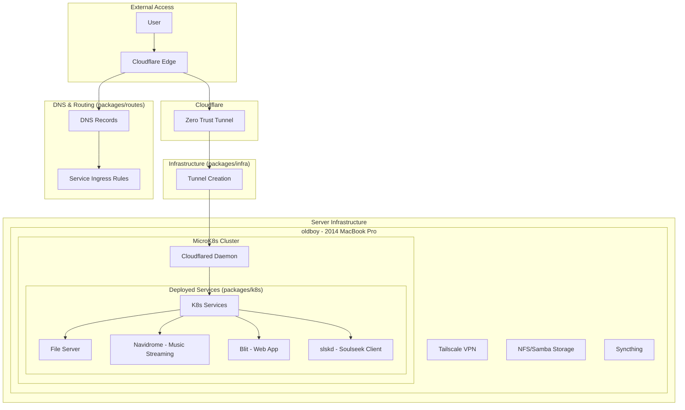

# JARITANET

[](https://github.com/radiosilence/jaritanet/actions/workflows/test.yml)
[](https://github.com/radiosilence/jaritanet/actions/workflows/cd.yml)
[](https://github.com/radiosilence/jaritanet/actions/workflows/email-tests.yml)

Infrastructure-as-code monorepo for securely exposing Kubernetes services through Cloudflare Tunnels.

## Architecture

Three Pulumi packages deploy in sequence to create a complete service exposure system:



## Package Structure

**packages/infra** - Creates Cloudflare Zero Trust tunnels and authentication
- Establishes secure tunnel endpoints
- Configures Cloudflare access policies

**packages/k8s** - Deploys services to Kubernetes clusters  
- Connects to clusters via Tailscale
- Deploys cloudflared daemon for tunnel connectivity
- Manages service deployments and configurations

**packages/routes** - Configures DNS records and service routing
- Maps external domains to internal services
- Manages Bluesky protocol and Fastmail DNS
- Creates tunnel ingress rules

## Deployment Flow

1. **Infrastructure** deploys Cloudflare tunnels
2. **Kubernetes** connects clusters and deploys services
3. **Routes** configures DNS and ingress routing

Traffic flows: `External Domain` → `Cloudflare` → `Tunnel` → `K8s Service`

## Server Management

Ansible playbooks provision and configure servers:
- MicroK8s cluster setup with storage and networking
- Tailscale VPN for secure cluster access  
- File sharing via NFS and Samba
- Automated service account creation for CI/CD

## Development

```bash
bun typecheck:infra  # Type check infrastructure
bun typecheck:k8s    # Type check Kubernetes  
bun typecheck:routes # Type check routes
./scripts/gen-schemas.ts  # Generate schemas
```
