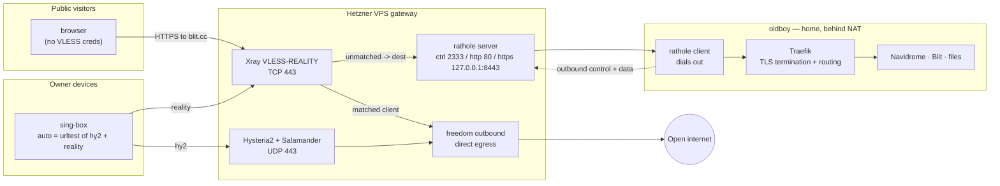
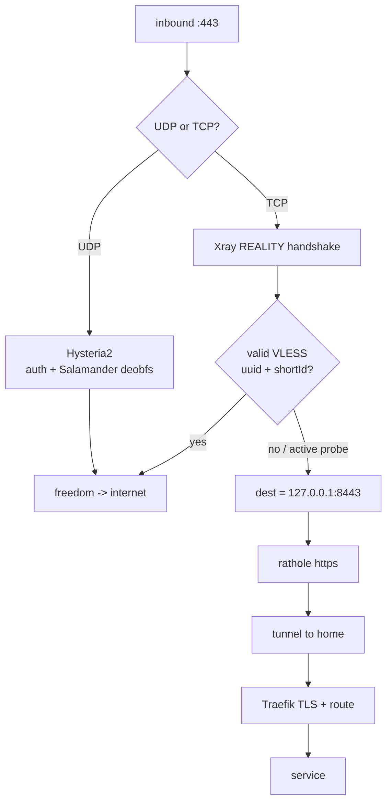
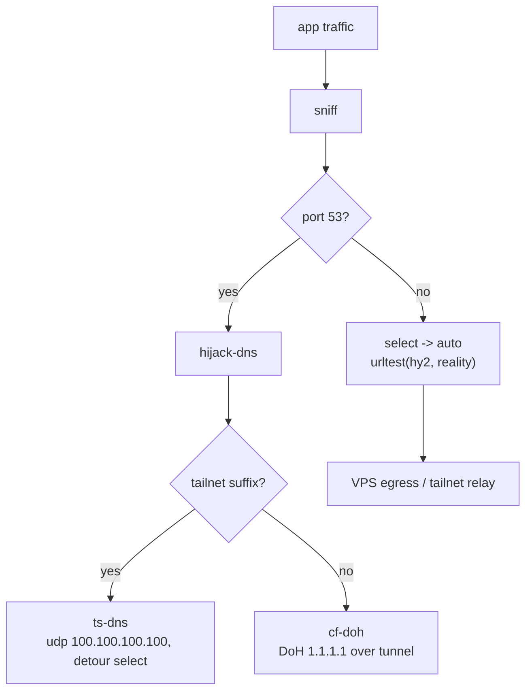
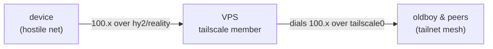

# Architecture

JARITANET runs one Hetzner VPS that does two unrelated jobs on the same
`:443`, plus a home box behind NAT that never exposes a port. This doc covers
the network topology and the transport/proxy layer; for the Pulumi package
layout and secrets see the [README](../README.md).

## The two data planes

The VPS wears two hats at once:

1. **Reverse proxy** for public home-hosted services (`blit.cc`, Navidrome,
   files). Public visitors hit the VPS; their traffic is tunnelled down to the
   home cluster over rathole. The home IP never appears in DNS and no home port
   is ever opened — the rathole client dials *out*.
2. **Censorship-resistant VPN egress** for the owner's devices. sing-box
   clients connect over Hysteria2 or VLESS-REALITY and egress to the open
   internet directly from the VPS.

The neat part: those two jobs share TCP `:443` deliberately. A public visitor
who doesn't hold a VLESS credential is treated by REALITY as untrusted and
**forwarded to the real service** — so the "decoy" that hides the proxy is
genuine, organically-visited traffic, not a fake.



## How `:443` is multiplexed

TCP and UDP `:443` are independent, so Hysteria2 (UDP) and Xray (TCP) never
collide. The interesting logic is on the TCP side, where Xray owns the port and
REALITY decides per-connection whether it's a proxy client or cover traffic.



A censor's active probe lands in the `no` branch: it gets a real TLS session to
the real service and sees a legitimate cert, indistinguishable from any other
visitor. That's what makes REALITY hard to fingerprint.

## Transport protocols

Neither egress transport is WireGuard or OpenVPN — both of those carry fixed,
trivially-classified signatures. These are chosen specifically to *not* look
like a VPN.

| Transport | Wire | DPI stance | Role |
|---|---|---|---|
| **Hysteria2** | QUIC over UDP/443 + Salamander obfs | Defeats protocol fingerprinting; still high-entropy UDP, so vulnerable to "unclassified UDP" heuristics and UDP-hostile networks | Daily driver — fast, loss-tolerant |
| **VLESS-Vision-REALITY** | TCP/443, mimics a real TLS 1.3 session | Strong — passes as genuine HTTPS, survives active probing | Fallback for UDP-blocked / censored networks |

**Why REALITY is slow on lossy links:** it's TCP, and tunnelled app traffic is
mostly TCP, so you stack TCP-in-TCP. Two retransmit + congestion loops fight
each other and back off exponentially on packet loss — the classic TCP
meltdown, plus single-stream head-of-line blocking. Hysteria2 sidesteps both:
QUIC does per-stream loss recovery and treats loss as loss rather than
congestion, so it stays smooth where REALITY crawls. This is a property of the
transports, not a misconfiguration.

**Network expectations:**

- Normal ISPs, mobile, home broadband → hy2 works, fast.
- Hotel / guest / captive-portal wifi → UDP is often blocked or throttled;
  expect frequent fallback to REALITY.
- State censorship (Egypt-tier) → high-entropy UDP is a throttle target; REALITY
  (looks like plain HTTPS) is the more reliable survivor.
- GFW-tier → UDP largely dead; REALITY is what gets through.

The client's `auto` group (urltest) picks whichever is healthy, so a device
degrades gracefully from fast-hy2 to slow-but-alive REALITY without manual
intervention.

## Client routing (sing-box)

One combined profile carries both transports and DNS handling. Everything —
including tailnet `100.x` — rides the `select`/`auto` groups, so all traffic
crosses the hostile network as obfuscated hy2/reality. The client runs **no
WireGuard**; the tailnet hop happens on the VPS (see below).



`hijack-dns` (after `sniff` in `route.rules`) is load-bearing: without it,
sing-box flings port-53 queries out the tunnel as raw packets to a dead internal
resolver; nothing resolves except cached names and the client looks offline.
With it, queries are answered via DoH to 1.1.1.1 — encrypted and tunnelled.

## Tailnet over the tunnel (censorship-resistant `100.x`)

The gateway VPS is itself a tailnet member. Because hy2/reality are
connection-level proxies (not raw IP tunnels), a client flow to `100.x` arrives
at the VPS and the VPS *dials that address locally* — the OS routes it out
`tailscale0` to the home nodes over the mesh. So the VPS needs nothing but
membership: **no IP forwarding, no NAT, no subnet-router advertisement.**



Why this beats a Tailscale-hostile censor: the only leg crossing the hostile
network is the obfuscated tunnel. The VPS↔tailnet leg (WireGuard + DERP + the
Tailscale control plane) happens from Germany, where none of it is blocked — the
censor never sees a Tailscale handshake.

Two profiles, one VPN slot (matters on iOS):

- **Native Tailscale app** — fast, direct peer-to-peer, full MagicDNS. Use on
  open networks. Dies where Tailscale is blocked.
- **This sing-box profile** — tailnet relayed through the VPS, obfuscated,
  survives censorship. Slower (relay hop + geography). Use when the native
  client can't connect.

Load-bearing on the VPS side: `tailscale up --accept-routes=false`. With routes
accepted, a peer advertising an exit node or routes swallows the VPS default
route → the relay and every service riding it go dark.

The `TS_AUTHKEY` secret is an **OAuth client secret** (`tskey-client-…`, with
the `auth_keys` scope and the tag), not a raw auth key — raw keys cap at 90-day
expiry, OAuth secrets don't. OAuth-minted keys default to ephemeral, so the
`up` command forces `ephemeral=false` to keep the relay persistent.

MagicDNS is best-effort here: `ts-dns` points at `100.100.100.100` detoured
through the tunnel, so the VPS resolves `*.ts.net` on the client's behalf. If a
sing-box version doesn't honour `detour` on a DNS server, fall back to raw
`100.x` IPs — and the native client covers names on open networks anyway.

See [`ansible/roles/singbox/README.md`](../ansible/roles/singbox/README.md) for
the template and how the profile is generated and delivered to devices.

## Edge nodes (multi-location)

Beyond the primary gateway, `edges` in config spins up standalone VPN boxes in
other locations — each a Hetzner VPS running hy2 + REALITY + a tailnet relay,
and nothing else (no rathole, no reverse proxy). Adding one is a config change:

```yaml
jaritanet:edges:
  - name: helsinki
    location: hel1
  - name: singapore
    location: sin
    serverType: cx23
```

On the next deploy each edge gets a server, a firewall (22 + 443 only), a
`<name>.<zone>` A record (default zone `radiosilence.dev`), and joins the
tailnet as `jaritanet-<name>`. Every node — primary + edges — is emitted as the
secret `singboxNodes` stack output; the deploy pipes that into the singbox
ansible role, which renders one profile with a **location picker** (`select`
group: `auto-all` = fastest anywhere, plus a per-node `auto-<name>`) and pushes
the updated URL/QR to Telegram. So: edit config, push, get a working URL.

**Why edges can use an external REALITY decoy** (unlike the primary): an edge
fronts no site of its own, so there's no own-domain to break by forwarding
probe traffic away. `edge.reality` defaults to `www.microsoft.com` — a real,
universally-reachable TLS site — and is overridable per edge. The primary keeps
its own-domain decoy because it must serve real visitors on the same `:443`.

Every edge is also a tailnet member, so any of them relays `100.x` into the
mesh — the same censorship-resistant tailnet path works whichever location you
pick. (This is the foundation for a future home-exit node: oldboy becomes just
another entry in the picker, exiting via the residential IP.)

## Hardening notes

Live tradeoffs worth knowing, not necessarily bugs:

- **The REALITY decoy is our own domain, and that's load-bearing — not a
  weakness to "fix."** REALITY has a single `dest` fallback, and every non-proxy
  TCP/443 connection (i.e. every real public visitor to the site) is forwarded
  there. Because `dest` is the home Traefik backend, visitors get the genuine
  site. Repointing `dest` at an external site (`www.microsoft.com` etc.) to
  borrow bigger crowd cover would serve *that* site to real visitors and break
  public access — you cannot both reverse-proxy your own domain on :443 and
  mimic someone else's. The cover is fine as-is: a real LE cert, real organic
  traffic, an unremarkable small HTTPS site. The only threat it doesn't beat is
  allowlist-style censorship (block everything except known-good domains), which
  is rare and extreme.
- **hy2 uses `insecure=1` + a self-signed cert.** Fine in practice — Salamander
  wraps the whole handshake so the cert never appears on the wire, and the obfs
  password gates access — but there's no cert pinning.
- **SSH (22) and rathole control (2333) are open to the world.** Both are
  authenticated (SSH is key-only ED25519; rathole is 64-char token). Tailnet-
  gating SSH would shrink the attack surface but adds lockout risk on a box
  whose whole job is being reachable, so it's left open by choice. 2333 must
  stay open regardless: the home client dials in from a dynamic NATed IP.
- **No hy2 bandwidth hints** in the client, so it runs default congestion
  control rather than Brutal — usually the friendlier choice on variable links.
