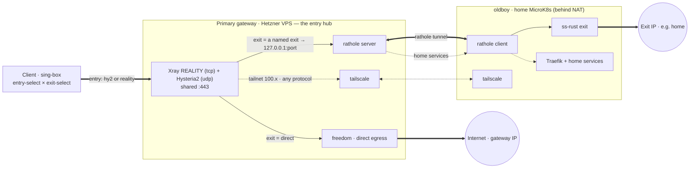
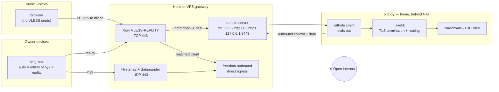
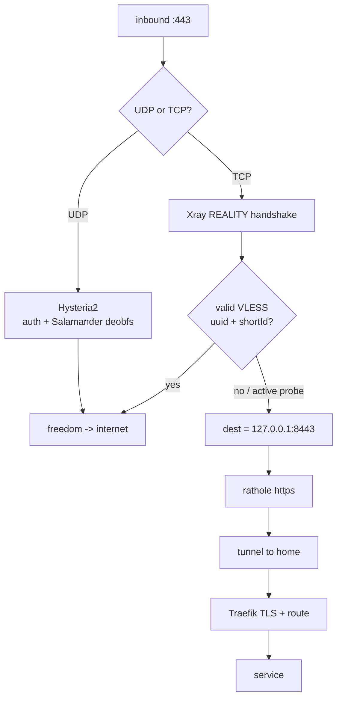
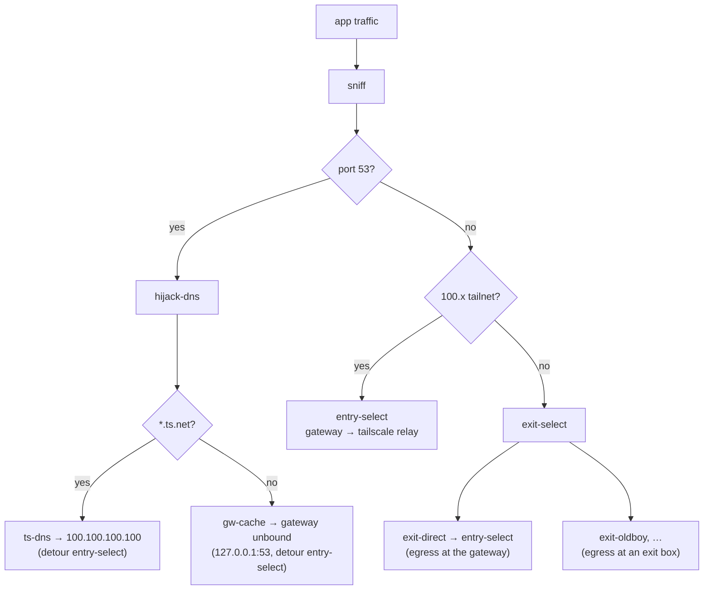
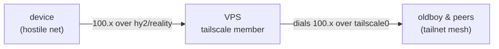
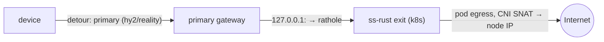

# Architecture

JARITANET is a personal anti-censorship + egress stack. A sing-box client picks
**how it enters** (which gateway/transport) and **where it egresses**
(direct, or via an exit node), all coordinated by one Pulumi program. Gateways
are disposable VPSes; the home box sits behind NAT and never exposes a port.
This doc covers the topology and transport layer; for the Pulumi package layout
and secrets see the [README](../README.md).

## The whole system, end to end

Every moving part and how a flow travels through it — client selection, the two
entry transports, the gateway's shared `:443`, the rathole reverse-tunnel, the
in-cluster exit, tailnet relay, and home services.

The gateway is the **hub**. The client picks how it *enters* (`entry-select` —
a protocol today, a gateway once there's more than one) and where the gateway
*egresses* it (`exit-select` — direct, or forwarded to an exit box). Everything
transits the gateway; exits are just `ss-rust + rathole` boxes it forwards to.



Reading it: the client always reaches the **gateway** first (via the chosen
protocol). Then `exit-select` decides what the gateway does — egress directly
(gateway's own IP), or dial `127.0.0.1:<port>`, which is that exit's rathole
loopback → the exit's ss-rust → egress at *its* IP (here, the home link).
Tailnet `100.x` and DNS ride the gateway's tailscale regardless of protocol.

The exit shown is oldboy (which also hosts the reverse-proxied home services),
but an exit is just `ss-rust + rathole` — a future Hetzner VPS exit is the same
two daemons via cloud-init, minus the services/tailnet-home roles. The sections
below zoom into each part.

## The two data planes

The VPS wears two hats at once:

1. **Reverse proxy** for public home-hosted services (`blit.cc`, Navidrome,
   files). Public visitors hit the VPS; their traffic is tunnelled down to the
   home cluster over rathole. The home IP never appears in DNS and no home port
   is ever opened — the rathole client dials *out*.
2. **Censorship-resistant VPN egress** for the owner's devices. sing-box
   clients connect over Hysteria2 or VLESS-REALITY and egress to the open
   internet directly from the VPS.

The neat part: those two jobs share TCP `:443` deliberately. A public visitor
who doesn't hold a VLESS credential is treated by REALITY as untrusted and
**forwarded to the real service** — so the "decoy" that hides the proxy is
genuine, organically-visited traffic, not a fake.



## How `:443` is multiplexed

TCP and UDP `:443` are independent, so Hysteria2 (UDP) and Xray (TCP) never
collide. The interesting logic is on the TCP side, where Xray owns the port and
REALITY decides per-connection whether it's a proxy client or cover traffic.



A censor's active probe lands in the `no` branch: it gets a real TLS session to
the real service and sees a legitimate cert, indistinguishable from any other
visitor. That's what makes REALITY hard to fingerprint.

## Transport protocols

Neither egress transport is WireGuard or OpenVPN — both of those carry fixed,
trivially-classified signatures. These are chosen specifically to *not* look
like a VPN.

| Transport | Wire | DPI stance | Role |
|---|---|---|---|
| **Hysteria2** | QUIC over UDP/443 + Salamander obfs | Defeats protocol fingerprinting; still high-entropy UDP, so vulnerable to "unclassified UDP" heuristics and UDP-hostile networks | Daily driver — fast, loss-tolerant |
| **VLESS-Vision-REALITY** | TCP/443, mimics a real TLS 1.3 session | Strong — passes as genuine HTTPS, survives active probing | Fallback for UDP-blocked / censored networks |

**Why REALITY is slow on lossy links:** it's TCP, and tunnelled app traffic is
mostly TCP, so you stack TCP-in-TCP. Two retransmit + congestion loops fight
each other and back off exponentially on packet loss — the classic TCP
meltdown, plus single-stream head-of-line blocking. Hysteria2 sidesteps both:
QUIC does per-stream loss recovery and treats loss as loss rather than
congestion, so it stays smooth where REALITY crawls. This is a property of the
transports, not a misconfiguration.

**Network expectations:**

- Normal ISPs, mobile, home broadband → hy2 works, fast.
- Hotel / guest / captive-portal wifi → UDP is often blocked or throttled;
  expect frequent fallback to REALITY.
- State censorship (Egypt-tier) → high-entropy UDP is a throttle target; REALITY
  (looks like plain HTTPS) is the more reliable survivor.
- GFW-tier → UDP largely dead; REALITY is what gets through.

The client's `auto` group (urltest) picks whichever is healthy, so a device
degrades gracefully from fast-hy2 to slow-but-alive REALITY without manual
intervention.

## Client routing (sing-box)

One combined profile carries both transports and DNS handling, behind the two
selectors: **`entry-select`** (how you reach the gateway) and **`exit-select`**
(where the gateway egresses you). The client runs **no WireGuard**; the tailnet
hop happens on the gateway (see below).



Two route rules do the work: `100.x` → `entry-select` (tailnet egresses at the
gateway, never via an exit), and everything else → `final: exit-select`.
`hijack-dns` (after `sniff`) is load-bearing: without it, sing-box flings
port-53 queries out the tunnel as raw packets to a dead internal resolver;
nothing resolves and the client looks offline. With it, `*.ts.net` resolves via
`ts-dns` (the gateway's tailnet resolver) and everything else via `gw-cache`.

**DNS is built for latency, not just leak-safety.** Every resolver is pinned to
`entry-select`, so DNS egresses at the gateway and never inherits an exit hop —
even when `exit-select` points at an exit box. `gw-cache` is a plain-UDP server
at `127.0.0.1:53`; the client dials that loopback *at the gateway end* through
the tunnel, hitting an unbound caching forwarder on the gateway with prefetch +
serve-expired. So a client-cache miss is answered from a Germany-local, already-
warm cache in one tunnel RTT rather than a round trip to the upstream from
wherever the client happens to be. On top of that, sing-box's `cache_file`
persists the DNS cache across restarts, so a cold app launch resolves recently-
seen names from disk (~0ms).

**No cleartext DNS anywhere in the chain.** The client↔gateway leg is plain UDP
but rides the encrypted tunnel (DoH's per-query TLS/HTTP2 framing would be
redundant there), and unbound forwards upstream to Cloudflare over DoT (:853), so
the gateway's own egress is encrypted too — Hetzner never sees a domain in the
clear. `cf-doh` (DoH → 1.1.1.1) stays in the profile as the manual-revert
resolver: sing-box does not auto-fail between DNS servers, so if the gateway
cache is ever down, flip `final` to it (also leak-safe, just no local cache).

## Tailnet over the tunnel (censorship-resistant `100.x`)

The gateway VPS is itself a tailnet member. Because hy2/reality are
connection-level proxies (not raw IP tunnels), a client flow to `100.x` arrives
at the VPS and the VPS *dials that address locally* — the OS routes it out
`tailscale0` to the home nodes over the mesh. So the VPS needs nothing but
membership: **no IP forwarding, no NAT, no subnet-router advertisement.**



Why this beats a Tailscale-hostile censor: the only leg crossing the hostile
network is the obfuscated tunnel. The VPS↔tailnet leg (WireGuard + DERP + the
Tailscale control plane) happens from Germany, where none of it is blocked — the
censor never sees a Tailscale handshake.

Two profiles, one VPN slot (matters on iOS):

- **Native Tailscale app** — fast, direct peer-to-peer, full MagicDNS. Use on
  open networks. Dies where Tailscale is blocked.
- **This sing-box profile** — tailnet relayed through the VPS, obfuscated,
  survives censorship. Slower (relay hop + geography). Use when the native
  client can't connect.

Load-bearing on the VPS side: `tailscale up --accept-routes=false`. With routes
accepted, a peer advertising an exit node or routes swallows the VPS default
route → the relay and every service riding it go dark.

The `TS_AUTHKEY` secret is an **OAuth client secret** (`tskey-client-…`, with
the `auth_keys` scope and the tag), not a raw auth key — raw keys cap at 90-day
expiry, OAuth secrets don't. OAuth-minted keys default to ephemeral, so the
`up` command forces `ephemeral=false` to keep the relay persistent.

MagicDNS is best-effort here: `ts-dns` points at `100.100.100.100` detoured
through the tunnel, so the VPS resolves `*.ts.net` on the client's behalf. If a
sing-box version doesn't honour `detour` on a DNS server, fall back to raw
`100.x` IPs — and the native client covers names on open networks anyway.

The profile is generated and delivered entirely by Pulumi — see
`packages/infra/src/modules/singbox.ts`. `buildProfile` constructs the config
as a TypeScript object (`JSON.stringify`, so it can't emit invalid JSON — no
templating), and `createSingboxDelivery` writes it to the file server over SSH
and notifies Telegram. Ansible is not involved; it only provisions the boxes.

## Edge nodes (multi-location)

Beyond the primary gateway, `edges` in config spins up standalone VPN boxes in
other locations — each a Hetzner VPS running hy2 + REALITY + a tailnet relay,
and nothing else (no rathole, no reverse proxy). Adding one is a config change:

```yaml
jaritanet:edges:
  - name: helsinki
    location: hel1
  - name: singapore
    location: sin
    serverType: cx23
```

On the next deploy each edge gets a server, a firewall (22 + 443 only), a
`<name>.<zone>` A record (default zone `radiosilence.dev`), and joins the
tailnet as `jaritanet-<name>`. Every node — primary + edges — feeds Pulumi's
`buildProfile`, which renders one profile with a **location picker**; Pulumi
writes it to the file server (change-detected by content hash) and pushes the
updated URL/QR to Telegram. So: edit config, push, get a working URL.

With multiple gateways, `entry-select` becomes nested: it chooses `auto-all`
(fastest node anywhere) or a per-host group. Each host is its own selector
(`helsinki`, `primary`, …) holding that node's `auto-<name>` + `hy2-<name>` +
`reality-<name>`, so you pick a location and can drill in to force a transport.
Leaf outbound tags are prefixed per host (tags must be globally unique); the
grouping is what you navigate. (`exit-select` — the egress axis — is separate;
see below.)

**Why edges can use an external REALITY decoy** (unlike the primary): an edge
fronts no site of its own, so there's no own-domain to break by forwarding
probe traffic away. `edge.reality` defaults to `www.microsoft.com` — a real,
universally-reachable TLS site — and is overridable per edge. The primary keeps
its own-domain decoy because it must serve real visitors on the same `:443`.

Every edge is also a tailnet member, so any of them relays `100.x` into the
mesh — the same censorship-resistant tailnet path works whichever location you
pick.

## Egress exit nodes (selectable egress location)

Entry and egress are **independent axes**. Entry = which gateway you connect
through (`entry-select`). Egress = where your traffic leaves the internet
(`exit-select`): either **direct** (at the gateway) or via an **exit node** that
NATs out its own IP — e.g. the home cluster, egressing the residential IP.

An exit is a substrate-agnostic unit — **rathole client + ss-rust** — as a k8s
Deployment (`modules/exit.ts`) today, or a cloud-init VPS later. Add one via the
`exits` config list:

```yaml
jaritanet:exits:
  - name: home
    port: 9000
```

It's reached through the **existing rathole tunnel**, not the tailnet. Each
exit's ss-rust port is surfaced on the **primary gateway's loopback**
(`127.0.0.1:<port>`) via a rathole service entry — the same pattern as the
Reality decoy `dest`:



The client's `exit-<name>` outbound is Shadowsocks to `127.0.0.1:<port>`,
detouring through the **primary** gateway. In a detour chain the inner address
resolves at the gateway end, so `127.0.0.1:<port>` means "this exit's rathole
loopback on the primary." Exits pin to the primary because **it's the only node
running rathole** — edges (also in `entry-select`) serve hy2/reality only, so
routing an exit through an edge would dial a dead loopback. `entry-select` still
governs *direct* egress across all gateways; exits transit the primary.

No kernel IP forwarding anywhere — ss-rust owns both ends of each flow
(connection-level), so there's no return-path routing to misconfigure on a
remote box. The exit pod egresses normally; microk8s' CNI SNATs to the node IP,
which is the home link. Topology is a pure function of the config lists,
expanded at `pulumi up`. (Making exits reachable via *any* gateway — the full
entry × exit cross-product — needs edges to also run rathole; deferred. When
multiple rathole gateways exist, `port` must be identical across them.)

## Hardening notes

Live tradeoffs worth knowing, not necessarily bugs:

- **The primary's REALITY decoy is our own domain, and that's load-bearing —
  not a weakness to "fix."** REALITY has a single `dest` fallback, and every
  non-proxy TCP/443 connection (i.e. every real public visitor to the site) is
  forwarded there. Because the primary's `dest` is the home Traefik backend,
  visitors get the genuine site. Repointing it at an external site would serve
  *that* site to real visitors and break public access — the primary cannot both
  reverse-proxy its own domain on :443 and mimic someone else's. The cover is
  fine as-is: a real LE cert, real organic traffic, an unremarkable HTTPS site.
  (Edges are different — they front no site, so they *do* use an external decoy;
  see Edge nodes. The only threat neither beats is allowlist-style censorship.)
- **hy2 uses `insecure=1` + a self-signed cert.** Fine in practice — Salamander
  wraps the whole handshake so the cert never appears on the wire, and the obfs
  password gates access — but there's no cert pinning.
- **SSH (22) and rathole control (2333) are open to the world.** Both are
  authenticated (SSH is key-only ED25519; rathole is 64-char token). Tailnet-
  gating SSH would shrink the attack surface but adds lockout risk on a box
  whose whole job is being reachable, so it's left open by choice. 2333 must
  stay open regardless: the home client dials in from a dynamic NATed IP.
- **hy2 defaults to adaptive congestion control (BBR), with Brutal opt-in.**
  The daily-driver `hy2-*` outbound (and the `auto` urltest) carry no bandwidth
  hints, so they stay adaptive and friendly on variable/metered links. A
  separate `hy2b-*` variant carries 1G/1G hints → Brutal (fixed-rate, ignores
  loss) and sits in the selector for manual use on a known-fat hostile pipe.
  Brutal is deliberately *not* the default: on a slow link it blasts loss into a
  small pipe and feels worse. Reality has no such knob — its speed is all MTU.
- **The tun stack is `mixed` (kernel TCP + gVisor UDP), and that's load-bearing
  for nesting another VPN inside this one.** A common use is nesting a UDP-based
  corporate VPN (e.g. AWS Client VPN, OpenVPN/UDP) inside the tunnel to shield
  its first hop from local DPI: the nested VPN's *endpoint* has no specific route
  so it falls to sing-box's default and egresses at the gateway (DPI sees only
  hy2/reality), while the routes the nested VPN pushes (its VPC CIDR) are more
  specific and send that traffic down its own tun. The catch: the kernel
  `system` stack silently drops the *nested UDP* even when routing is provably
  correct — only gVisor's UDP stack reassembles it and does endpoint-independent
  NAT. So `mixed`/`gvisor`, never `system`, if nesting is in play. Operational
  gotcha: reconnecting/updating sing-box tears down anything nested on top of it,
  so the order is always **sing-box first, then (re)dial the inner VPN**.
