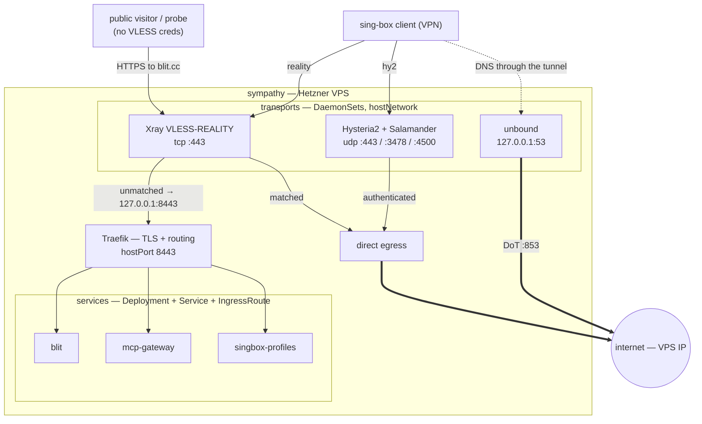
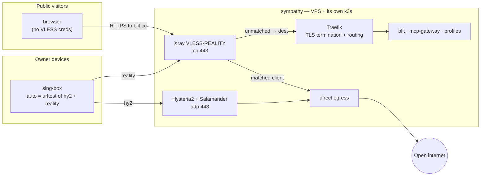
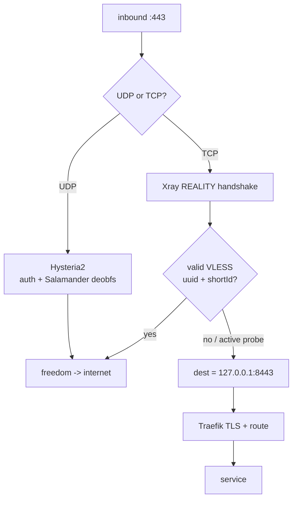
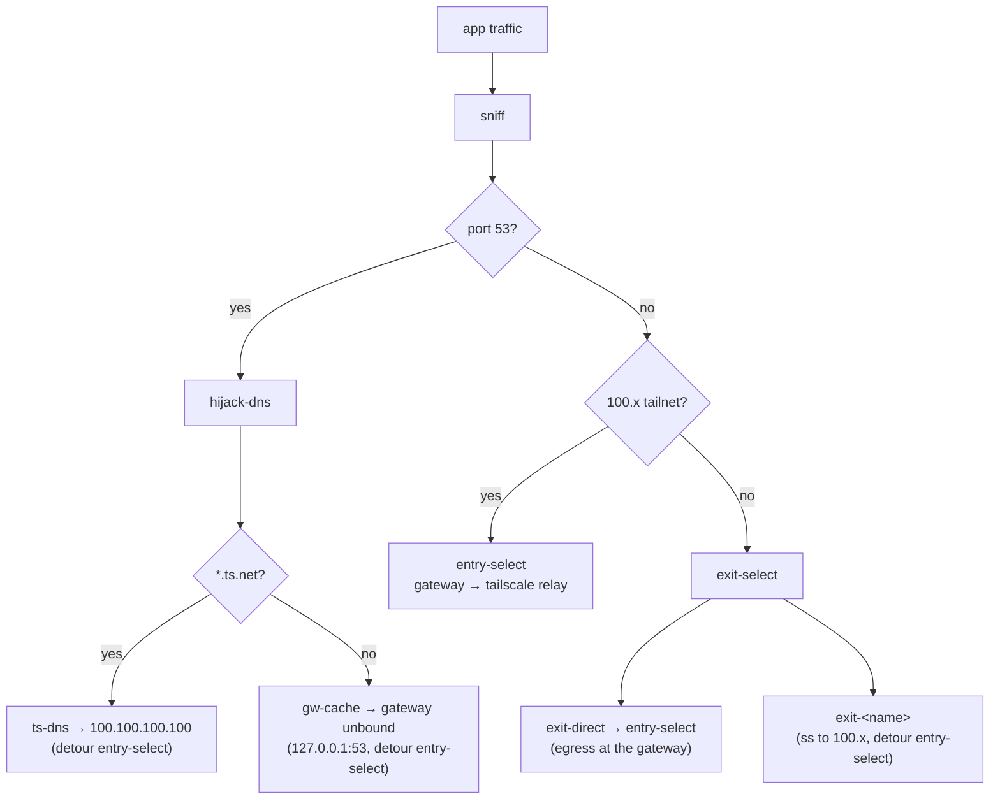
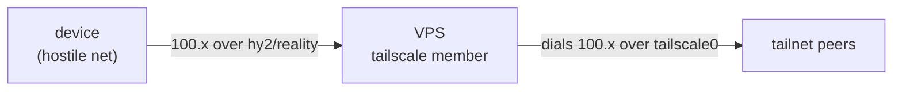
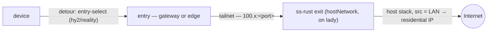

# Architecture

JARITANET is a personal anti-censorship + egress stack. A sing-box client picks
**how it enters** (which gateway/transport) and **where it egresses** (direct,
or via an exit node), all coordinated by one Pulumi program. This doc covers the
topology and transport layer; for the package layout and secrets see the
[README](../README.md).

Everything runs on one Hetzner VPS that hosts its own k3s cluster. The VPN
transports, the DNS cache, the tailnet relay, Traefik and the web services are
all workloads in it. The box itself runs k3s and sshd and nothing else.

## The whole system, end to end

The gateway is the **hub**. A client picks how it *enters* (`entry-select`) and
where it *egresses* (`exit-select`). Everything transits an entry; an exit is a
second hop past it, over the tailnet.


```mermaid
flowchart TD
  CLIENT["sing-box client (VPN)"]
  VISITOR["public visitor / probe<br/>(no VLESS creds)"]

  subgraph vps["sympathy — Hetzner VPS"]
    subgraph entry["transports — DaemonSets, hostNetwork"]
      XR["Xray VLESS-REALITY<br/>tcp :443"]
      HY["Hysteria2 + Salamander<br/>udp :443 / :3478 / :4500"]
      UB["unbound<br/>127.0.0.1:53"]
    end
    TR["Traefik — TLS + routing<br/>hostPort 8443"]
    subgraph apps["services — Deployment + Service + IngressRoute"]
      BL["blit"]
      MCP["mcp-gateway"]
      PROF["singbox-profiles"]
    end
    FREE["direct egress"]
    TR --> BL
    TR --> MCP
    TR --> PROF
  end

  VPSIP(("internet — VPS IP"))

  CLIENT -->|reality| XR
  CLIENT -->|hy2| HY
  CLIENT -.->|"DNS through the tunnel"| UB
  VISITOR -->|"HTTPS to blit.cc"| XR

  XR -->|"unmatched → 127.0.0.1:8443"| TR
  XR -->|"matched"| FREE
  HY -->|"authenticated"| FREE
  FREE ==> VPSIP
  UB ==>|"DoT :853"| VPSIP
```

On the shared `:443`, Xray (TCP) and Hysteria2 (UDP) classify the connection: a
valid VPN client is proxied; an unmatched TLS connection — a real visitor or an
active probe — is forwarded to `dest 127.0.0.1:8443`, which is Traefik's
`hostPort`. Both live in the host's network namespace, so that loopback address
means what it says and never leaves the box. It is absent from the firewall's
inbound allow-list (`:22`, `:80`, `:443`, `:6443`, Hysteria2's UDP ports), so
nothing outside can reach it.

There is no tunnel between the gateway and the cluster: they are the same box,
and tunnelling one to itself buys nothing. Traefik binds a host port and Xray
relays to it over loopback.

Tailnet `100.x` isn't drawn here — it rides the same entry transports and the
gateway dials it locally over `tailscale0`; see
[Tailnet over the tunnel](#tailnet-over-the-tunnel-censorship-resistant-100x).

## The two data planes

The VPS wears two hats at once:

1. **Reverse proxy** for the public services it hosts (`blit.cc`, the MCP
   gateway, the profile server). Visitors hit `:443`, are classified as
   non-clients, and are relayed to Traefik in the same cluster.
2. **Censorship-resistant VPN egress** for the owner's devices. sing-box
   clients connect over Hysteria2 or VLESS-REALITY and egress to the open
   internet directly from the VPS. Measured at 1.0Gbit — `hostNetwork` means the
   transports bind the real NIC with no translation in the path, so running them
   as pods costs nothing.

The neat part: those two jobs share TCP `:443` deliberately. A public visitor
who doesn't hold a VLESS credential is treated by REALITY as untrusted and
**forwarded to the real service** — so the "decoy" that hides the proxy is
genuine, organically-visited traffic, not a fake.


```mermaid
flowchart LR
    subgraph client["Owner devices"]
        SB["sing-box<br/>auto = urltest of hy2 + reality"]
    end

    subgraph pub["Public visitors"]
        BR["browser<br/>(no VLESS creds)"]
    end

    subgraph vps["sympathy — VPS + its own k3s"]
        XR["Xray VLESS-REALITY<br/>tcp 443"]
        HY["Hysteria2 + Salamander<br/>udp 443"]
        TR["Traefik<br/>TLS termination + routing"]
        SVC["blit · mcp-gateway · profiles"]
        FREE["direct egress"]
    end

    INET(("Open internet"))

    BR -->|"HTTPS to blit.cc"| XR
    SB -->|"reality"| XR
    SB -->|"hy2"| HY

    XR -->|"matched client"| FREE
    HY --> FREE
    FREE --> INET

    XR -->|"unmatched → dest"| TR --> SVC
```

## Where the gateway's daemons run

With `gateway.k3s` the cluster runs on the gateway itself, so Xray, Hysteria2,
tailscaled and unbound are Deployments in it rather than systemd units installed
over SSH. The daemons and their configuration are unchanged; what changes is who
starts them and where their secrets come from.

All four are `hostNetwork`, and that is a requirement rather than a convenience.
Xray must own the host's real `:443` and see real client source addresses, and
its `dest` is `127.0.0.1:8443` — Traefik's `hostPort`, which only means Traefik
from inside the host's namespace. unbound answers `127.0.0.1:53` for clients
dialling that loopback *through* the tunnel. tailscaled has to put `tailscale0`
where the other two resolve their routes.

That is also why they are **DaemonSets**. With `hostNetwork` two replicas can
never coexist on a node — they would collide on the same ports — so "exactly one
per matching node" is the shape, and the primitive enforces it instead of a
Deployment's update strategy working around it. The update strategy still
matters for the same reason: `maxUnavailable: 1` with `maxSurge: 0` (the
DaemonSet default, written out because it is load-bearing) deletes the old pod
before creating its replacement, which is the only order that can succeed on an
exclusive port. Traefik sat 20 days on a stale pod for getting this wrong.

They select on the `jaritanet.radiosilence.dev/vpn-entry` node label rather than a
hostname, so serving an entry is a property of a node. `lady` joining the
cluster does not make it a VPN entry, and making an edge one later is a label
rather than another module. The gateway labels itself after k3s comes up.

The key comes from `vpnEntryLabel` and is read once, then passed to both the
labelling command and every DaemonSet's `nodeSelector` — as a required argument,
so the compiler rejects a call site that omits it. That is deliberate: the two
must agree exactly, and a selector matching no node schedules nothing while the
cluster reports perfectly healthy. The prefix is a subdomain we actually own;
Kubernetes never resolves it, but a label key naming a domain belonging to
somebody else is a claim we have no right to make.

Two things they need from the node rather than from their own spec, both because
`hostNetwork` means the node's networking is theirs: BBR and `fq`, and
`net.core.rmem_max`/`wmem_max` at 16MB. quic-go asks Hysteria2's UDP socket for
a multi-megabyte receive buffer and the kernel silently caps it at `rmem_max`,
which Ubuntu ships at 208KB — the symptom is dropped datagrams under load and a
warning on the connection path, not at start-up. Both live in
`createNetworkTuning`, which asserts the values took rather than only writing
the file.

The REALITY keypair, its shortId, every client UUID, the hy2 obfs and per-admin
passwords and the hy2 self-signed cert are all generated by Pulumi and mounted
from a Secret. Previously they were minted on the box and the public half read
back over SSH, which is stronger in one respect — the private key existed only
on the machine using it — and impossible in a container that can be rescheduled
or rebuilt. The REALITY key is *derived* from a stored 32-byte seed rather than
generated per run (`realityKeypair`), or every deploy would replace the inbound
and invalidate every client profile.

Migrating the one gateway that had been provisioned the old way was done by
hand, and deliberately left no code behind. A teardown resource existed briefly
and was removed: with `gateway.k3s` set nothing installs those daemons any more,
so a rebuilt box never has them, and Pulumi cannot observe a box drifting back —
a remote command is fire-and-forget — so it guaranteed nothing while still being
able to fail on every deploy. It also delegated removal to two vendor uninstall
scripts, one of which quietly declined, which is how it took the transports down
without putting their replacements up.

The lesson worth keeping is the assertion it carried rather than the resource:
the failure being guarded against is invisible from `kubectl`, because a pod
that loses a port race still reports `Running` while a surviving host daemon
serves the traffic. If a transport ever looks healthy and behaves wrongly, check
which cgroup owns the socket before anything else.

Edges keep the SSH path: they have no cluster, and one box per location running
two daemons is not worth a control plane.

## Why the kubeconfig is read separately from the install

The Kubernetes provider is configured from the gateway's kubeconfig, and Pulumi
replaces a provider whose configuration changed — along with every resource
created through it. That is Cilium, every Service, IngressRoute, NetworkPolicy
and PersistentVolume, including the CNI the cluster needs in order to come back.

So the provider's configuration must not move for reasons that have nothing to
do with the credentials. Taking the kubeconfig from the installer's stdout meant
it did: the installer's output *was* the credential, so any edit to its command
line regenerated it, and an ordinary flag change was indistinguishable from a
cluster rebuild — visible only as a long list of ordinary-looking replacements
in a preview nobody reads that closely.

The kubeconfig is therefore its own `command.remote`, triggered on the server
rather than on the installer. A new server is what mints new credentials: the
installer preserves `/var/lib/rancher/k3s`, so the cluster CA survives any
number of reinstalls on the same box. Rotating it some other way means bumping
the tag in that command's triggers, and the cascade that follows is then the
real thing rather than noise.

Two changes still legitimately replace the provider, and both mean the
credentials genuinely moved: replacing the server, and switching `apiHost`
between the tailnet name and the public IP.

## Keeping k3s current on nodes nothing can reach

The gateway's k3s is installed over SSH, so its version follows
`Pulumi.main.yaml`. A node joined from a cloud-init seed — `lady`, a Lima VM —
is installed once and then managed by nothing: Pulumi has no connection to it,
cannot learn what it is running, and has no mechanism that would ever move it.
Left alone it sits on whatever was current the day it was flashed, indefinitely,
inside a cluster whose control plane keeps advancing.

Rancher's **system-upgrade-controller** closes that without needing a route to
the box. It watches `Plan` CRDs and schedules a privileged Job on each matching
node that enters the host's namespace, replaces `/usr/local/bin/k3s` and
restarts the unit — so reach is a consequence of cluster membership. That is
what makes it fit here rather than the obvious alternative of another
`command.remote`. A remote command needs a connection, and a connection is
exactly what a seeded node does not have: Pulumi did not create it, holds no key
for it, and has no address to reach it at. Break-glass SSH does not help — it
installs a key on boxes Pulumi already connects to, which is the set that never
had the problem.

Two plans, since servers and agents cannot move together: the agent plan's
`prepare` step blocks on the server plan finishing, which is the order
Kubernetes' version skew policy requires. The server plan **cordons rather than
drains**. The gateway is the only server, so draining it means evicting every
workload to nowhere; cordoning takes it out of scheduling while the unit
restarts and leaves running pods alone. The API is genuinely unavailable for
that restart. Nothing in the data path depends on it — the transports are
DaemonSet pods, which neither cordon nor drain evicts, and Traefik holds its
`hostPort` throughout — so the window costs a deploy that happens to overlap it,
not traffic.

The version is not automated and should not be: `.github/tracked-versions.yml`
excludes k3s and Cilium because bumping either changes the thing every other
entry is deployed onto. What is automated is *arrival*. `k3s.version` stays one
value driving both a fresh install and the rolling upgrade of everything already
running, so a bump is a deliberate PR that reaches the whole fleet rather than
only the node Pulumi happened to install.

Cilium does not ride along: it is a Helm release Pulumi manages, so the two
versions share a config file and nothing else.

- `k3s.version` → Plan → nodes
- `k3s.ciliumVersion` → Helm release → cluster

Two paths, one required pairing, and no component positioned to notice they
disagree — the failure being a cluster that comes up looking healthy and moves
no packets. So `CILIUM_K8S_SUPPORT` encodes Cilium's e2e-tested Kubernetes range
per minor and `K3sConfSchema` asserts it while parsing, which makes a half-bump
a red preview before a single resource is touched. Same reasoning as
`vpnEntryLabel` being required rather than defaulted: when the healthy-looking
failure is the expensive one, the config surface is where to catch it.

An unknown Cilium minor fails rather than passes. A table that silently accepts
anything it has not heard of stops being a table.

Writing the table found a pin already outside it, by one Cilium minor, having
drifted there from a comment that had gone stale. Untested rather than broken,
and working — which is why a comment could not have caught it and why the check
is worth the file.

## Two resolvers, and why they cannot be one

unbound and coredns both answer DNS on this box and are not redundant, because
their consumers want opposite things.

**unbound serves VPN clients.** Their profile points DNS at `127.0.0.1:53` with
a detour through the tunnel, so the query arrives at the *gateway's* loopback:
nothing on the local network sees it, and unbound forwards upstream to
Cloudflare over DoT. No lookup is ever in the clear, at either end. It also
caches with prefetch and serve-expired, so a client miss is answered from a
warm, Germany-local cache in one tunnel RTT rather than a fresh recursion from
wherever the client is. Xray resolves destinations through it too, which is what
`domainStrategy: IPIfNonMatch` needs.

**coredns serves pods**, resolving Services and forwarding the rest to 1.1.1.1.

Pointing clients at coredns would break both properties at once: upstream DNS
would leave the box in plaintext, and client lookups would be answered against
the cluster's search domains — so a user's request could resolve to an internal
Service address and be routed into the cluster. unbound costs 13Mi to keep them
apart.

coredns needs `--resolv-conf` pointed somewhere real. Left alone, k3s hands it
the host's `/etc/resolv.conf`, which on Ubuntu is systemd-resolved's stub at
`127.0.0.53` — an address that means *the pod itself* inside coredns's network
namespace, where nothing is listening. Every external name then returns SERVFAIL
and no pod can reach the internet, while the VPN keeps working perfectly, since
its transports never resolve anything.

## How `:443` is multiplexed

TCP and UDP `:443` are independent, so Hysteria2 (UDP) and Xray (TCP) never
collide. The interesting logic is on the TCP side, where Xray owns the port and
REALITY decides per-connection whether it's a proxy client or cover traffic.


```mermaid
flowchart TD
    IN["inbound :443"] --> PROTO{"UDP or TCP?"}
    PROTO -->|UDP| HY["Hysteria2<br/>auth + Salamander deobfs"] --> OUT["freedom -> internet"]
    PROTO -->|TCP| XR["Xray REALITY handshake"]
    XR --> MATCH{"valid VLESS<br/>uuid + shortId?"}
    MATCH -->|yes| OUT
    MATCH -->|"no / active probe"| DEST["dest = 127.0.0.1:8443"]
    DEST --> TR["Traefik TLS + route"] --> SVC["service"]
```

A censor's active probe lands in the `no` branch: it gets a real TLS session to
the real service and sees a legitimate cert, indistinguishable from any other
visitor. That's what makes REALITY hard to fingerprint.

## Transport protocols

Neither egress transport is WireGuard or OpenVPN — both of those carry fixed,
trivially-classified signatures. These are chosen specifically to *not* look
like a VPN.

| Transport | Wire | DPI stance | Role |
|---|---|---|---|
| **Hysteria2** | QUIC over UDP/443, /3478 and /4500 + Salamander obfs | Defeats protocol fingerprinting; still high-entropy UDP, so vulnerable to "unclassified UDP" heuristics and UDP-hostile networks | Daily driver — fast, loss-tolerant |
| **VLESS-Vision-REALITY** | TCP/443, mimics a real TLS 1.3 session | Strong — passes as genuine HTTPS, survives active probing | Fallback for UDP-blocked / censored networks |

**Why hy2 listens on two ports.** No single UDP port survives every network,
and the two failure modes are mirror images. Any FortiGate doing TLS inspection
blocks QUIC on `udp/443` as a matter of course — it cannot deep-inspect QUIC, so
it kills it to force browsers back to TCP TLS it *can* inspect. Measured on a
filtered pub network: `udp/443` handshakes hang, while STUN to `udp/3478` and
`udp/19302` both answer, so UDP egress itself was never the problem.

The alternates are chosen as ports a restrictive network must permit *on
purpose*, not ones it forgot about — an allowlist is what we're up against, so
an obscure port is worth nothing. `3478` is STUN, open anywhere WhatsApp and
Teams calls work; `4500` is IPsec NAT-T, open anywhere staff VPNs work. The
places that block VoIP to stop those calls (Egypt, UAE, Saudi) invert it
exactly: `3478` dies first and `443` lives. Serving all three and letting the
client's urltest find the survivor beats betting on any one of them. Keep the
list short — each port is another probe on every switch and another row in the
picker. Each port is its own hysteria process — a container on the gateway, a
`hysteria-server@` instance on an edge — not a DNAT port-hop: no nat table to
persist across reboots, and each port fails independently. Alt ports are
`gateway.hysteria.altPorts` (same key on an edge).

**Why REALITY is slow on lossy links:** it's TCP, and tunnelled app traffic is
mostly TCP, so you stack TCP-in-TCP. Two retransmit + congestion loops fight
each other and back off exponentially on packet loss — the classic TCP
meltdown, plus single-stream head-of-line blocking. Hysteria2 sidesteps both:
QUIC does per-stream loss recovery and treats loss as loss rather than
congestion, so it stays smooth where REALITY crawls. This is a property of the
transports, not a misconfiguration.

**Network expectations:**

- Normal ISPs, mobile, home broadband → hy2 works, fast.
- Hotel / guest / captive-portal wifi → UDP is often blocked or throttled;
  expect frequent fallback to REALITY.
- State censorship (Egypt-tier) → high-entropy UDP is a throttle target; REALITY
  (looks like plain HTTPS) is the more reliable survivor.
- GFW-tier → UDP largely dead; REALITY is what gets through.

The client's `auto` group (urltest) picks whichever is healthy, so a device
degrades gracefully from fast-hy2 to slow-but-alive REALITY without manual
intervention.

## Client routing (sing-box)

One combined profile carries both transports and DNS handling, behind the two
selectors: **`entry-select`** (how you reach the gateway) and **`exit-select`**
(where you egress). They compose freely — every exit detours through
`entry-select`, so any entry reaches any exit. The client runs **no WireGuard**;
the tailnet hop happens on the gateway (see below).


```mermaid
flowchart TD
    APP["app traffic"] --> SNIFF["sniff"]
    SNIFF --> DNSQ{"port 53?"}
    DNSQ -->|yes| HIJACK["hijack-dns"]
    HIJACK --> RES{"*.ts.net?"}
    RES -->|yes| TSDNS["ts-dns → 100.100.100.100<br/>(detour entry-select)"]
    RES -->|no| GW["gw-cache → gateway unbound<br/>(127.0.0.1:53, detour entry-select)"]
    DNSQ -->|no| TN{"100.x tailnet?"}
    TN -->|yes| ENTRY["entry-select<br/>gateway → tailscale relay"]
    TN -->|no| EXIT["exit-select"]
    EXIT --> ED["exit-direct → entry-select<br/>(egress at the gateway)"]
    EXIT --> EN["exit-&lt;name&gt;<br/>(ss to 100.x, detour entry-select)"]
```

Two route rules do the work: `100.x` → `entry-select` (tailnet egresses at the
gateway, never via an exit), and everything else → `final: exit-select`.
`hijack-dns` (after `sniff`) is load-bearing: without it, sing-box flings
port-53 queries out the tunnel as raw packets to a dead internal resolver;
nothing resolves and the client looks offline. With it, `*.ts.net` resolves via
`ts-dns` (the gateway's tailnet resolver) and everything else via `gw-cache`.

**DNS is built for latency, not just leak-safety.** Every resolver is pinned to
`entry-select`, so DNS egresses at the gateway and never inherits an exit hop —
even when `exit-select` points at an exit box. `gw-cache` is a plain-UDP server
at `127.0.0.1:53`; the client dials that loopback *at the gateway end* through
the tunnel, hitting an unbound caching forwarder on the gateway with prefetch +
serve-expired. So a client-cache miss is answered from a Germany-local, already-
warm cache in one tunnel RTT rather than a round trip to the upstream from
wherever the client happens to be. On top of that the client caches
aggressively: `dns.optimistic` serves an expired entry instantly and refreshes
it in the background (no lookup ever blocks on a stale hit), and `cache_file`
(`store_dns`) persists that cache across restarts — so a cold app launch
resolves recently-seen names from disk (~0ms).

**No cleartext DNS anywhere in the chain.** The client↔gateway leg is plain UDP
but rides the encrypted tunnel (DoH's per-query TLS/HTTP2 framing would be
redundant there), and unbound forwards upstream to Cloudflare over DoT (:853), so
the gateway's own egress is encrypted too — Hetzner never sees a domain in the
clear. `cf-doh` (DoH → 1.1.1.1) stays in the profile as the manual-revert
resolver: sing-box does not auto-fail between DNS servers, so if the gateway
cache is ever down, flip `final` to it (also leak-safe, just no local cache).

## Tailnet over the tunnel (censorship-resistant `100.x`)

The gateway VPS is itself a tailnet member. Because hy2/reality are
connection-level proxies (not raw IP tunnels), a client flow to `100.x` arrives
at the VPS and the VPS *dials that address locally* — the OS routes it out
`tailscale0` to the home nodes over the mesh. So the VPS needs nothing but
membership: **no IP forwarding, no NAT, no subnet-router advertisement.**


```mermaid
flowchart LR
    DEV["device<br/>(hostile net)"] -->|"100.x over hy2/reality"| VPS["VPS<br/>tailscale member"]
    VPS -->|"dials 100.x over tailscale0"| HOME["tailnet peers"]
```

Why this beats a Tailscale-hostile censor: the only leg crossing the hostile
network is the obfuscated tunnel. The VPS↔tailnet leg (WireGuard + DERP + the
Tailscale control plane) happens from Germany, where none of it is blocked — the
censor never sees a Tailscale handshake.

Two profiles, one VPN slot (matters on iOS):

- **Native Tailscale app** — fast, direct peer-to-peer, full MagicDNS. Use on
  open networks. Dies where Tailscale is blocked.
- **This sing-box profile** — tailnet relayed through the VPS, obfuscated,
  survives censorship. Slower (relay hop + geography). Use when the native
  client can't connect.

Load-bearing on the VPS side: `tailscale up --accept-routes=false`. With routes
accepted, a peer advertising an exit node or routes swallows the VPS default
route → the relay and every service riding it go dark.

On the gateway this runs as a pod, which means the tailnet goes with the
cluster. That is accepted rather than defended against: sshd on the public IP is
the way back in (see Break-glass SSH), so nothing is built to keep tailscale up
while k3s is down.

Node state lives in a Kubernetes Secret, not on the node's disk, so the identity
survives reprovisioning the box. The Secret is created empty by Pulumi and never
written by it again — RBAC cannot scope `create` to a resource name, so a
container minting its own would need create on every Secret in the namespace,
which is where the VPN credentials live. Creating it up front buys a Role that
names one object and grants get/update/patch on it. Pulumi ignores the contents
from then on; containerboot owns them.

The `tailnet.authKey` secret is an **OAuth client secret** (`tskey-client-…`, with
the `auth_keys` scope and the tag), not a raw auth key — raw keys cap at 90-day
expiry, OAuth secrets don't. OAuth-minted keys default to ephemeral, so the
`up` command forces `ephemeral=false` to keep the relay persistent.

MagicDNS is best-effort here: `ts-dns` points at `100.100.100.100` detoured
through the tunnel, so the VPS resolves `*.ts.net` on the client's behalf. If a
sing-box version doesn't honour `detour` on a DNS server, fall back to raw
`100.x` IPs — and the native client covers names on open networks anyway.

The profile is generated and served entirely by Pulumi. `buildProfile`
(`modules/singbox.ts`) constructs the config as a TypeScript object
(`JSON.stringify`, so it cannot emit invalid JSON — no templating), and
`createProfileServer` (`modules/profiles.ts`) puts every user's profile into one
Secret as a path→body table, served by `serve-from-env` at
`<profile-host>/<slug>.json`.

The routing table *is* the content, which is the point: a rotated slug stops
existing rather than lingering as a file someone must remember to delete. It
replaced writing the same JSON over SSH to a file server, which needed a
specific machine to exist — the thing you cannot rely on while migrating.

Served from `radiosilence.dev` rather than `blit.cc` deliberately: FortiGuard
rated the latter "Other Adult Materials", so on a filtered network — precisely
where a VPN profile is wanted — a device could not fetch its own subscription.
(That rating has since been corrected on appeal. The domain split stays; being
one category-database mistake away from undeliverable profiles is not a
dependency worth keeping.)

## Edge nodes (multi-location)

Beyond the primary gateway, `edges` in config spins up standalone VPN boxes in
other locations — each a Hetzner VPS running hy2 + REALITY + a tailnet relay,
and nothing else (no reverse proxy). Adding one is a config change:

```yaml
jaritanet:edges:
  - name: helsinki
    location: hel1
  - name: singapore
    location: sin
    serverType: cx23
```

On the next deploy each edge gets a server, a firewall (22 + 443 only), a
`<name>.<zone>` A record (default zone `radiosilence.dev`), and joins the
tailnet as `jaritanet-<name>`. Every node — primary + edges — feeds Pulumi's
`buildProfile`, which renders a per-user profile with a **location picker**;
Pulumi writes each to the file server (change-detected by content hash) and
pushes every user's URL to Telegram. So: edit config, push, get a working URL.

With multiple gateways, `entry-select` becomes nested: it chooses `auto-all`
(fastest node anywhere) or a per-host group. Each host is its own selector
(`helsinki`, `primary`, …) holding that node's `auto-<name>` and every leaf
under it, so you pick a location and can drill in to force one exact path.

A leaf is named for the thing a hostile network blocks individually, which
differs by transport: hy2 varies by **port** (`hy2-<node>-443`, `-3478`,
`-4500`) since its SNI is cosmetic and never reaches the wire, while REALITY
varies by **SNI** (`reality-<node>-google`, `-bing`, …) on TCP/443 alone, since
the name it claims is the whole disguise. Tags carry the node prefix because
they must be globally unique; the grouping is what you navigate. (`exit-select`
— the egress axis — is separate; see below.)

**Why edges can use an external REALITY decoy** (unlike the primary): an edge
fronts no site of its own, so there's no own-domain to break by forwarding
probe traffic away. `edge.reality` defaults to `www.microsoft.com` — a real,
universally-reachable TLS site — and is overridable per edge. The primary must
keep `dest` pointed at its own backend to serve real visitors on the same
`:443`, so only its SNI borrows an untouchable name; see Hardening notes.

Every edge is also a tailnet member, so any of them relays `100.x` into the
mesh — the same censorship-resistant tailnet path works whichever location you
pick.

## Egress exit nodes (selectable egress location)

Entry and egress are **independent axes**. Entry = which gateway you connect
through (`entry-select`). Egress = where your traffic leaves the internet
(`exit-select`): either **direct** (at the gateway) or via an **exit node** that
NATs out its own IP — e.g. the home cluster, egressing the residential IP.

**A residential exit is IPv4-only, by circumstance rather than choice**, and
this is worth knowing before the next one exists. The house has no IPv6 at all,
so v6 egress fails with *Network is unreachable* — no route, rather than a
blocked one. An application with a hardcoded IPv6 endpoint therefore fails
through such an exit and works on direct egress, which reads as "the VPN is
broken" and cost real debugging hours in July before the exit turned out to be
the variable. Telegram was the observed casualty.

Nothing in the cluster can fix that: dual-stack CNI would hand pods addresses
with nowhere to route. The alternatives are NAT64/DNS64 at the gateway or IPv6
from the ISP, and neither is worth it for an exit whose entire purpose is
presenting a residential **IPv4** address. Accepted deliberately — if something
you rely on breaks only through the exit, suspect this first.

An exit is an **ss-rust** server, as a `hostNetwork` DaemonSet
(`packages/vpn/src/exit.ts`) pinned to the machine whose address it presents.
Add one via the `exits` config list:

```yaml
jaritanet:exits:
  - name: lady
    nodeLabel: jaritanet.radiosilence.dev/vpn-exit
    server: 100.74.66.121
```


```mermaid
flowchart LR
    DEV["device"] -->|"detour: entry-select (hy2/reality)"| GW["entry — gateway or edge"]
    GW -->|"tailnet — 100.x:&lt;port&gt;"| SS["ss-rust exit (hostNetwork, on lady)"]
    SS -->|"host stack, src = LAN → residential IP"| INET(("Internet"))
```

**`hostNetwork` is the mechanism, not a shortcut.** In the node's own namespace
the host stack picks the source address by routing, so no CNI masquerade sits in
the path and lady egresses her residential IPv4 (verified: default route
`via 192.168.50.1 dev eno1`, egress `168.199.77.151`). It is also what puts
`tailscale0` in the pod's namespace, so the port an entry dials is the node's
tailnet address rather than a ClusterIP the overlay would have to carry.

**The tailnet is the transport.** lady is behind NAT with nothing forwarded,
deliberately; every path to her is one she opened outbound. Her k3s node IP is
already her tailnet address, so this reuses a path that carries the cluster's
own node-to-node traffic. Every gateway and edge is a tailnet member, which is
why the client's `exit-<name>` outbound detours through **`entry-select`** rather
than pinning to the primary: the two axes are genuinely independent, and the
full entry × exit cross-product comes for free. (The predecessor pinned to the
primary only because that was the one node terminating the reverse tunnel.)

That membership is therefore load-bearing rather than optional. `createEdge`
gates tailscale on `tailnet.authKey`, and an entry without a tailnet reaches no
exit at all while the profile goes on offering every pair — so an `exits` list
with no `authKey` fails the preview instead.

**Composable across entries, but an edge cannot host an exit.** Adding a
Helsinki edge tomorrow needs no change here and none to the exit: it joins
`entry-select`, it is a tailnet member, and it reaches every exit. Hosting one is
a different question. An exit is a `hostNetwork` DaemonSet, so it lands only on a
**cluster node**, and edges are standalone Hetzner boxes with systemd transports
that never join — `createEdge` does not call `createK3s`. The two sets are
disjoint today, in both directions: an edge cannot host an exit, and a NATed home
node can never be an entry, which is fundamental rather than a gap. Giving an
edge an egress identity as well as an entry one needs either joining edges to the
cluster or an `-systemd` exit variant beside the transports that already have
one.

**The label is the deployment.** `nodeLabel` decides which machine egresses, and
the DaemonSet controller watches Nodes — so marking one schedules the exit onto
it and unmarking it tears the pod down, with no `pulumi up` in between. Measured
on this cluster: `desiredNumberScheduled` went 0 → 1 **1.09s** after the label
landed, and 1 → 0 **0.36s** after it was removed.

That makes the label the single piece of state an exit depends on, and the only
one whose absence nothing reports — an unlabelled node is zero pods on a cluster
that looks perfectly healthy. So `node` names the machine and this program
applies the label itself, as a `NodePatch` over the Kubernetes API rather than
SSH: a box seeded from cloud-init has no connection here, but it is a cluster
member, which is the same reach that carries k3s upgrades to it. `patchForce` is
what makes that reconcile rather than merely assert — an apply carrying the same
value co-owns the field without complaint, and it is the diverged state, where
someone has changed the label by hand, that conflicts with `kubectl label`'s
field manager and needs forcing back.

Hand-labelling still works, and is how you move an exit for an afternoon. It is
no longer what holds one in place.

`server` is **pinned, not stable**. A tailnet address survives reboots but not a
re-registration — sympathy's moved from `100.69.78.57` to `100.78.67.16` in #238
when its identity left the DaemonSet's Secret for systemd state — and the
failure is quiet: the DaemonSet stays healthy, the profile stays valid, and the
entry dials an address nobody answers on. Reading it from the Node's
`InternalIP` would be self-correcting (a seeded agent joins with
`--node-ip=$(tailscale ip -4)`, so it is already there) and is deliberately not
done: it would make every preview depend on that Node object existing, putting
the gateway's deploy behind a home box being in the cluster. On a rebuild — the
gateway being restored, the home node not yet rejoined — that is the wrong
failure. So it is written down, and re-read by hand if an exit ever
re-registers.

No kernel IP forwarding anywhere — ss-rust owns both ends of each flow
(connection-level), so there's no return-path routing to misconfigure on a
remote box. That is also what makes an offline exit legible: `exit-select` is a
manual selector, so a human is the failover, and a dial that is refused or times
out at a named address is far easier to read than a handshake that succeeds and
then silently swallows packets. Topology is a pure function of the config lists,
expanded at `pulumi up`.

**Why not the alternatives.** A Tailscale exit node (`--advertise-exit-node`) is
a whole-device default-route override, so the gateway selecting it would send
*everything* out of the house — the exact failure `--accept-routes=false` exists
to prevent — and there is no per-flow selection, which is what an exit axis is.
Cilium's egress gateway is the k8s-native answer and leaves the pod alone, but
wants cluster-wide `bpf.masquerade`, resolves its egress IP once (a DHCP renewal
on the home LAN leaves it dropping), and black-holes traffic behind a successful
handshake when the gateway node is down. A hand-rolled WireGuard peer is a worse
tailnet: no DERP fallback, no NAT traversal, and its config lives on lady's disk
where Pulumi cannot reach it.

Throughput does not discriminate between any of these — a residential upstream
caps every one of them long before its own overhead does.

## mariastew's egress sits on neither axis

mariastew (`apps/mariastew/`) also opens outbound connections to the open
internet — a BitTorrent swarm, in its case — and it deliberately answers to
neither axis above. It has no entry to pick: it is a cluster workload, not a
sing-box client, so nothing about it touches Xray, Hysteria2 or `entry-select`.
And its `NetworkPolicy` sends that traffic straight out rather than through the
tailnet to an exit's ss-rust, which is a decision worth recording rather than
an omission — the shape looks, at a glance, like traffic that belongs on the
exit axis. Two reasons it doesn't: the traffic is indistinguishable from
ordinary home-network downloading, which is what it should look like — routing
it through an exit's IP would make it foreign traffic entering someone else's
swarm from a datacentre range, and those get tracker-blocked far more readily
than a residential one; and an exit's whole point is *selectable* egress
location, which buys nothing here since the pod already runs on the node
holding the disks it writes to — the same file-node label samba and syncthing
use. It also has no inbound port: the home network forwards nothing, so aria2
only ever dials out, and a swarm with no incoming peer connected is this
service's normal resting state rather than a symptom.

## Multi-user access (admin / guest)

The VPN is multi-tenant. The `vpnUsers` config value is one comma-separated
list where a trailing `+` marks an admin — `jc+,guest1` → `jc` admin, `guest1`
guest. `conf.ts` parses it into `{name, role}[]`; unset falls back to a single
implicit owner-admin, so pre-RBAC deploys keep full access. Each user gets their
own credentials and their own sing-box profile at `<profile-host>/<slug>.json`
(slug derived from a Pulumi-generated base + name — deterministic, so a
subscription URL is stable across deploys, but unguessable without the base,
which rotates with `gateway.credentialRotation`).
Removing a user from `vpnUsers` and redeploying drops their route from the
table, so the URL 404s rather than serving revoked credentials, and their
identity disappears from Xray and hy2 — a hard revoke.

| | Admin | Guest |
|---|---|---|
| Reality (Xray) | ✅ | ✅ |
| Hysteria2 | ✅ | ❌ |
| Exits | all | none (direct egress only) |
| Tailnet `100.x` | ✅ | ❌ (blackholed) |

**Enforcement is server-side, not profile-shaped.** A guest could hand-edit
their profile JSON; the restrictions still hold because they live at the gateway:

- **Guests are reality-only by design** — and that's what makes the rest hard.
  Reality is their sole entry, and Xray tags each inbound flow with the client's
  `email` (= the user name, an arbitrary label, not an address), so rules can
  match on `"user"` — a genuine per-user dimension. hy2 has no equivalent: its
  ACL matches addresses, ports and protocols and never sees who authenticated,
  so giving guests hy2 would open an unpoliced door — hence they get none (no
  hy2 credential exists for them).
- **Identity + revocation** — one REALITY UUID per user in Xray's `clients`;
  admins additionally in hy2's `userpass` map. Drop the user → the credential
  vanishes → locked out. Since exits and tailnet are only reachable *through* an
  entry, killing the entry kills everything downstream.
- **Exits** — gated by the ss-rust PSK, which is simply omitted from guest
  profiles, so a guest has no exit outbound to select even if they edit the JSON.
  They now sit at tailnet addresses too, so the guest tailnet blackhole below
  denies them a second time, on a rule that was already there.
- **Everything that isn't the public internet** — an Xray routing rule blackholes
  guest flows to the tailnet, loopback and RFC1918. Enumerating what a guest may
  *not* touch is the losing side of the argument, so the rule denies every
  address that isn't the internet rather than the exit port range alone.

  **This only works because `routing.domainStrategy` is `IPIfNonMatch`.** These
  are IP rules, and under Xray's default `AsIs` an IP rule never matches a
  request whose destination is a *domain* — so a guest editing their profile to
  dial a hostname they control, with an A record pointing into the tailnet, fell
  through to `direct` and reached the mesh. `IPIfNonMatch` resolves after a
  non-matching round and matches again. An IP deny-list in front of a
  non-resolving strategy is decoration; if the strategy is ever changed back,
  these rules quietly stop meaning anything.

Delivery is owner-relayed: a bot can't cold-DM a handle, so on change the owner
gets one Telegram message grouping users under Admins / Guests, each URL a
tap-to-copy `<code>` block plus a `copy_text` inline-keyboard button.

## Break-glass SSH

Each box's only key is the ED25519 pair Pulumi generates for it, which lives in
stack state and is never exported. `adminSshKey` adds a human's key on top,
on the gateway and every edge.

It buys one thing, and it is worth being precise about which. Reading host
files, host networking and even `systemctl` are all reachable from a privileged
pod with `hostPID` and `nsenter` — SSH adds nothing there. The case it exists
for is **k3s failing to come up**: no API server, no kubectl, no privileged pod.
The mechanism for adding a key is the broken thing at that moment, which is why
the key is installed on every deploy rather than when it is wanted.

Four decisions hold it up:

**It arrives over SSH, not through `sshKeys` or `userData`.** Hetzner applies
both only at creation, so changing either forces a replacement — a new IP, a new
REALITY keypair, and every client profile rotating. `createAdminSshAccess` is a
`command.remote.Command` over the connection Pulumi already holds, the same
idiom as `createNetworkTuning`. Rotating the key is an ordinary deploy.

**It never touches the `authorized_keys` Pulumi authenticates with.** The key
goes in `/etc/ssh/admin_authorized_keys`, selected by an `sshd_config.d` drop-in
that lists root's own file first. A mistake in the shared file locks the deploy
out of the box it is deploying to, with no way back in. `sshd -t` runs before
anything is reloaded and the drop-in is removed if it rejects, so a bad config
fails the Pulumi resource rather than the daemon. `sshd -T` then asserts that the
daemon actually resolves the file: sshd takes the first `AuthorizedKeysFile` it
obtains, so a directive ahead of the include would leave a drop-in that reads as
installed and selects nothing.

**It is triggered by the server's id, not only by the key.** `dependsOn` orders
the command after the box; it does not re-run it when the box is replaced.
Triggered by the key alone the resource keeps its recorded success across a
rebuild, so the new box comes up with no admin key and the stack reports no
drift — nothing asks to be fixed. That is how the 26.04 rebuild produced a
gateway whose break-glass access had never been installed, and why
`createNetworkTuning` and `createAutomaticPatching` take the same trigger.

**Absent secret means no resource**, matching how `tailnet.authKey` gates the tailnet
relay. Removing the secret deletes the key from the boxes on the next deploy.

The reload is conditional on `ssh.service` being active: Ubuntu 24.04 activates
sshd from `ssh.socket`, where each connection is a fresh process that reads the
config anyway, and starting `ssh.service` there would fight the socket for `:22`.

## Hardening notes

Live tradeoffs worth knowing, not necessarily bugs:

- **The primary's SNI and its `dest` are deliberately different things, and the
  mismatch is the tradeoff.** REALITY has a single `dest` fallback, and every
  non-proxy TCP/443 connection (i.e. every real public visitor to the site) is
  forwarded there, so `dest` must stay the home Traefik backend or public access
  breaks — the primary cannot reverse-proxy its own domain on :443 while also
  relaying probes to someone else's server. The SNI has no such constraint, and
  pinning it to our own domain turned out to be the more dangerous half:
  content-filtering middleboxes choose what to TLS-intercept from the SNI's
  reputation category, FortiGuard rates `blit.cc` as "Other Adult Materials",
  and any FortiGate running adult filtering (pubs, trains, schools, hotels)
  therefore forges a cert for it and every REALITY handshake dies with
  `x509: certificate signed by unknown authority`. A one-page CV site gives the
  classifier nothing to overturn that with. So the SNI borrows names from
  categories no filter dares block. What it costs is the decoy's realism — an
  active prober who connects with a borrowed SNI gets Traefik's default cert
  rather than a matching chain, and a passive observer sees, say, a Google
  ClientHello aimed at a Hetzner IP that has never been Google. That trades
  well: mis-rating by an automated category database is a routine, observed
  failure, while deliberate probing of this box is not. Against an adversary who
  probes, the fix is an SNI dispatcher on :443 (own domains → Traefik,
  everything else → REALITY with a matching external `dest`), not a return to
  the own-domain SNI. (Edges have neither problem — they front no site, so their
  `dest` *is* the site they mimic. The only threat none of this beats is
  allowlist-style censorship.)
- **One borrowed identity isn't enough, so `serverNames` is a list.** The ways a
  decoy dies don't overlap: a category filter forges whatever it rates as adult,
  while a national firewall blocks the biggest names outright. `www.google.co.uk`
  is camouflage in a British pub and a red flag in China, where `www.bing.com`
  and `www.apple.com` still pass. The server accepts every name on the list —
  keys, shortIds and `dest` are shared — and the client carries one outbound per
  name inside its urltest, so it settles on an identity the local network
  tolerates without anyone touching a setting. This is also what finally gives
  **guests** unattended failover: they are reality-only, so before the list a
  single intercepted SNI was a total outage for them. Two costs to keep in mind.
  Each name is another probe every urltest interval, on top of one per hy2 port,
  so the list should stay short rather than exhaustive. And a name whose real
  service lives in one country (`www.baidu.com`, `vk.com`) is a *stronger*
  anomaly than a global one when pointed at a German IP, since SNI and
  destination plainly disagree — they earn their place by surviving category
  filters, not by being convincing to a firewall that checks.
- **hy2 uses `insecure=1` + a self-signed cert.** Fine in practice — Salamander
  wraps the whole handshake so the cert never appears on the wire, and the obfs
  password gates access — but there's no cert pinning.
- **SSH (22) is open to the world.** Key-only ED25519, so it is authenticated,
  but reachable. Tailnet-gating it would shrink the attack surface and adds
  lockout risk on a box whose whole job is being reachable — and the tailnet is
  a pod on that cluster, so gating it would remove exactly the access needed
  when the cluster is the thing that broke. Left open by choice.
- **The NetworkPolicies are enforced now, and the first thing they caught was
  ours.** The old home cluster ran flannel, a pure overlay with **no policy
  engine at all**: a NetworkPolicy was accepted by the API server, stored,
  listed by `kubectl get netpol` — and implemented by nothing. Every policy in
  this repo was decorative, proved empirically when a pod reached an address a
  policy plainly denied.

  k3s here runs `--flannel-backend=none --disable-network-policy` with Cilium as
  the CNI, so they mean something. The immediate consequence was a real outage:
  Hydra's migration Job could not reach Postgres, because Postgres admits
  `app=mcp-gateway` and `app=mcp-gateway-hydra` and a Job's pod carries nothing
  but `job-name` and `controller-uid`. A denial drops rather than refuses, so it
  presented as a dial timeout to a Service with healthy endpoints — the
  hardest-to-read symptom of the lot.

  Worth internalising: policies written under a non-enforcing CNI have never
  been tested, so switching CNI is not a hardening step but a behavioural
  change. Anything that talks to anything should be assumed broken until shown
  otherwise.

- **hy2 uses adaptive congestion control (BBR) everywhere; Brutal is not
  offered.** Setting bandwidth hints switches Hysteria2 to Brutal, which paces
  to a fixed rate and ignores loss — it stomps through lossy censored *fat*
  links, and on a slow or metered one it blasts loss into a small pipe and feels
  worse. A `hy2b-*` variant carrying 1G/1G hints used to sit in the selector for
  manual use, and was dropped: the rate was a guess rather than a measured line,
  which is the case where Brutal hurts, and being manual-pick-only it never
  entered the urltest that does the actual work. Re-add it tuned to a real
  measurement if a fat hostile link ever justifies it. Reality has no such knob —
  its speed is all MTU.
- **The tun stack is `mixed` (kernel TCP + gVisor UDP), and that's load-bearing
  for nesting another VPN inside this one.** A common use is nesting a UDP-based
  corporate VPN (e.g. AWS Client VPN, OpenVPN/UDP) inside the tunnel to shield
  its first hop from local DPI: the nested VPN's *endpoint* has no specific route
  so it falls to sing-box's default and egresses at the gateway (DPI sees only
  hy2/reality), while the routes the nested VPN pushes (its VPC CIDR) are more
  specific and send that traffic down its own tun. The catch: the kernel
  `system` stack silently drops the *nested UDP* even when routing is provably
  correct — only gVisor's UDP stack reassembles it and does endpoint-independent
  NAT. So `mixed`/`gvisor`, never `system`, if nesting is in play. Operational
  gotcha: reconnecting/updating sing-box tears down anything nested on top of it,
  so the order is always **sing-box first, then (re)dial the inner VPN**.
